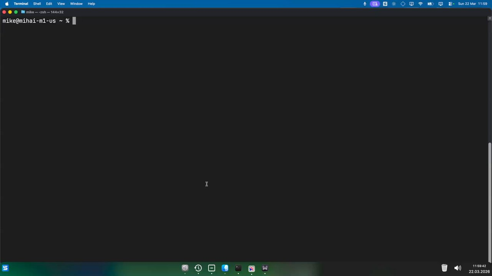

# Wispr Lightning

I use [Wispr Flow](https://wispr.com) for voice dictation every day. It's great software — but it runs on Electron, which means it ships a full Chromium browser to display a menu bar icon. On my MacBook Air with 8 GB of RAM, it would crash under real workloads (Chrome, VS Code, Claude Code, Slack all running). So I rewrote it from scratch in native Swift.

Same transcription backend. Same features. **31× less RAM. 84× smaller binary. One process instead of eleven.**

## Performance

Measured on the same machine (macOS 15.3), both apps idle.

| Metric | Wispr Lightning | Wispr Flow | Difference |
|---|---|---|---|
| **RAM (idle)** | 18 MB | ~560 MB | **31× less** |
| **CPU (idle)** | ~0% | ~21% | |
| **Processes** | 1 | 11 | **11× fewer** |
| **App size** | 5.2 MB | 438 MB | **84× smaller** |

Wispr Flow spawns 11 OS processes at launch — 4 renderers, GPU compositor, network service, audio helper, plugin helper, crash reporter, Swift helper, main shell. Together they consume ~560 MB of RAM doing nothing.

Wispr Lightning is a single native process. The OS parks it at 0% CPU between interactions.

## Demo

[](https://www.loom.com/share/e2c4c33d832441fb9ee2383b0305fe54)

## How it works

```
┌─────────────────────────────────────────────────────┐
│  Hotkey pressed                                     │
│  ├─ Pause music (Apple Music / Spotify)             │
│  ├─ Start AVAudioEngine recording                   │
│  ├─ Show recording overlay                          │
│  │                                                  │
│  Hotkey released                                    │
│  ├─ Capture active app context (bundle ID, window)  │
│  ├─ OCR visible screen text for formatting context  │
│  ├─ Stream audio → Wispr transcription API (WSS)    │
│  ├─ [Optional] AI polish pass with custom prompt    │
│  ├─ Inject text at cursor via Accessibility API     │
│  ├─ Save to local history (SQLite)                  │
│  └─ Resume music                                    │
└─────────────────────────────────────────────────────┘
```

The core pipeline: record → transcribe → format → inject. Context-aware formatting reads the active app and on-screen text via OCR so dictated text matches the style of what you're writing in — code comments get formatted differently than emails.

**~6,400 lines of Swift. No frameworks beyond Foundation and AppKit. One binary.**

## Features

- **Push-to-talk dictation** — hold a configurable hotkey to record, release to transcribe and inject text
- **Context-aware formatting** — uses the active app and on-screen text (via OCR) to intelligently format transcriptions
- **Auto-polish** — optionally rewrites transcriptions with a custom AI prompt before injecting
- **Processing indicator** — overlay transitions from Recording → Processing → Done
- **Music auto-pause** — pauses Apple Music / Spotify during recording, resumes after
- **Transcription history** — browse and search past dictations in local SQLite
- **Menu bar app** — lives in the status bar, zero UI clutter

## Install

```bash
./install.sh
```

Builds a release binary, bundles it into `Wispr Lightning.app`, and copies it to `/Applications`.

### Permissions

After first launch, grant these in **System Settings → Privacy & Security**:

- **Accessibility** — for text injection into other apps
- **Input Monitoring** — for global hotkey capture
- **Microphone** — prompted automatically on first recording

## Build

```bash
swift build             # debug
swift build -c release  # release
```

## Requirements

- macOS 13+
- Swift 5.9+
- A [Wispr](https://wispr.com) account (valid subscription required)

## Disclaimer

This is an independent project. It is not affiliated with, endorsed by, or connected to [Wispr](https://wispr.com) in any way. "Wispr" and "Wispr Flow" are trademarks of their respective owners.

## License

Source-available — see [LICENSE](LICENSE). You may view and study the code for personal and educational purposes. Redistribution, commercial use, and derivative works are not permitted.
