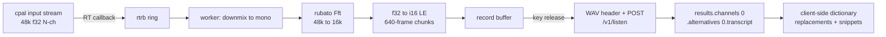

# LibAudioProviders research


## [answer]

"# Cross-platform audio capture + Deepgram — source-verified report

All crate claims below were read from cloned repo source at the tagged release; all Deepgram claims from `developers.deepgram.com` (the `.md` canonical docs and the published AsyncAPI/OpenAPI specs) plus the official Rust SDK source.

---

## PART A — AUDIO CAPTURE

### Q1. Stable device identifier across restarts

**Verdict: WORKS — natively, no FFI needed.** This is the single biggest reason to pin **cpal 0.18.x** and not an older 0.15/0.16 release.

**Crate:** `cpal = "0.18.1"` (published 2026-06-07).

cpal 0.18 added `DeviceTrait::id()` returning a `DeviceId` that is *exactly* the native stable id on both hosts:

- **macOS** → `kAudioDevicePropertyDeviceUID` (the CoreAudio UID string, e.g. `AppleUSBAudioEngine:...` / `BuiltInMicrophoneDevice`), read via `AudioObjectGetPropertyData` and wrapped as `DeviceId::new(HostId::CoreAudio, uid_string)`.
- **Windows** → `IMMDevice::GetId()` (the WASAPI endpoint id string, `{0.0.1.00000000}.{guid}`), wrapped as `DeviceId::new(HostId::Wasapi, id_str)`.

`DeviceId` implements `Display` (`"coreaudio:<uid>"` / `"wasapi:<endpoint-id>"`) and `FromStr`, and `HostTrait::device_by_id(&DeviceId) -> Option<Device>` resolves it back. **Persist `device.id()?.to_string()`; on next launch parse with `DeviceId::from_str` and call `host.device_by_id()`.**

**Gotchas**
- `id()` returns `Result<DeviceId, Error>` — it can fail with `ErrorKind::DeviceNotAvailable` if the device vanished between enumeration and the property read. Handle it, don't unwrap.
- `device_by_id`'s default impl is a *linear scan* over `devices()` comparing ids — O(n) with an FFI call per device. Fine for a settings dialog; don't call it per audio callback.
- Use `DeviceTrait::description()` (`cpal::DeviceDescription`, has name/manufacturer/`InterfaceType`) for the UI label, and `id()` for persistence. Never persist the name.
- macOS aggregate/virtual devices (Loopback, BlackHole, Krisp) have UIDs too, but a UID whose backing hardware is gone will simply not appear in `devices()` — treat "id not found" as "fall back to default input".
- The `DeviceId` string embeds the host prefix, so a config file written on macOS won't accidentally resolve on Windows.

**Escape hatch to native ids** (if you ever need more than the UID):
- macOS: `cpal::platform::Device` (coreaudio host) exposes `Device::new(audio_device_id: AudioDeviceID)`; combine with `objc2-core-audio 0.3.2` for arbitrary `AudioObjectGetPropertyData` calls.
- Windows: `cpal::host::wasapi::Device::immdevice(&self) -> Option<IMMDevice>` is **`pub`** — you get the live COM `IMMDevice` and can read any `PKEY_*` from its property store.

**Fallback if it fails:** none needed. (If you were stuck on cpal ≤0.16, which only had `name()`, the fallback was a composite key of `name + host + channel-count + supported-sample-rates` — fragile with two identical USB mics. Don't do that; upgrade.)

---

### Q2. 48 kHz f32 multi-channel → 16 kHz mono s16le in 640-frame chunks

**Verdict: WORKS. Use `rubato`'s FFT (synchronous) resampler, not the async sinc one, and not `dasp`.**

**Crate:** `rubato = "4.0.0"` (published 2026-07-09). **Note: rubato 4.0 is a total API rewrite** — the old `SincFixedIn` / `FftFixedInOut` / `FastFixedIn` type names are gone, replaced by `Async` + `FixedAsync` and `Fft` + `FixedSync`, and buffers now go through the `audioadapter` 5.0 traits.

**Which resampler:** `rubato::Fft` with `FixedSync::Output`. 48000→16000 is a fixed *rational* ratio (3:1), so you want the synchronous FFT resampler: it is the cheapest, has a bounded fixed delay, and is allocation-free after construction. `Async::new_sinc` is for *drifting/adjustable* ratios (clock sync, varispeed) — you don't have that; it costs more CPU for no benefit. `Async::new_poly` is the cheap-and-dirty option and is measurably worse for 3:1 decimation because its anti-aliasing is weak — with 48→16 kHz you must reject everything above 8 kHz or you get audible aliasing, which directly hurts ASR word error rate.

**Why not `dasp`:** `dasp 0.11.0` was last published **2020-05-29** — six years stale, no maintenance. Its `Converter`/`interpolate::sinc` path also does not give you fixed output chunk sizes. Use it for nothing here. (`dasp_sample` survives as a transitive dep of rodio purely for sample-type conversion traits.)

**Concrete pipeline** — the critical detail is **downmix first, then resample**, so the resampler runs on 1 channel instead of N:

```rust
use rubato::{Fft, FixedSync, Resampler, Indexing};
use audioadapter_buffers::direct::InterleavedSlice;

// Constructed once, off the audio thread.
// chunk_size = 640 output frames == 40 ms @ 16 kHz == 1280 bytes s16le.
let mut rs = Fft::<f32>::new(
    48_000,          // sample_rate_input
    16_000,          // sample_rate_output
    640,             // chunk_size (frames, on the FIXED side)
    1,               // nbr_channels  <- mono, because we downmix first
    FixedSync::Output,
)?;

// Scratch buffers, sized once:
let need_in  = rs.input_frames_max();     // >= 1920 for 3:1
let mut mono_in  = vec![0.0f32; need_in];
let mut mono_out = vec![0.0f32; 640];
let mut pcm      = vec![0i16;   640];
```

**Downmix** (cpal delivers interleaved; `data: &[f32]`, `config.channels` = N):
```rust
// Average across channels. Do NOT just take channel 0: on a stereo USB
// interface with the mic on the right input, channel 0 is silence.
let n = channels as usize;
let inv = 1.0 / n as f32;
for (dst, frame) in mono_scratch.iter_mut().zip(data.chunks_exact(n)) {
    *dst = frame.iter().sum::<f32>() * inv;
}
```
If the device reports >2 channels and is a real multi-mic array, prefer channel 0 or a documented mix — averaging uncorrelated array channels can partially cancel. For 1–2 channels, averaging is correct.

**Resample + quantise:**
```rust
let want = rs.input_frames_next();               // varies per call with FixedSync::Output
// accumulate `want` mono frames in a ring buffer, then:
let adapter_in  = InterleavedSlice::new(&mono_in[..want], 1, want).unwrap();
let mut adapter_out = InterleavedSlice::new_mut(&mut mono_out, 1, 640).unwrap();
let (_consumed, produced) = rs.process_into_buffer(&adapter_in, &mut adapter_out, None)?;
debug_assert_eq!(produced, 640);

for (d, s) in pcm.iter_mut().zip(&mono_out) {
    *d = (s.clamp(-1.0, 1.0) * i16::MAX as f32) as i16;
}
let bytes: &[u8] = bytemuck::cast_slice(&pcm);   // 1280 bytes, native LE
```

**Gotchas**
- `process_into_buffer` is the real-time-safe entry point; `process()` **allocates** an `InterleavedOwned` per call — never call it from an audio callback.
- With `FixedSync::Output`, `input_frames_next()` *varies call to call*. You must feed the resampler from a ring buffer, not directly from the cpal callback slice — cpal's buffer size and the resampler's demand are unrelated.
- Do the resampling **off** the cpal callback thread. Push raw f32 from the callback into an SPSC ring (`rtrb`), resample on a worker. cpal's callback is the RT thread; FFTs and network sends do not belong there.
- `Fft::new` picks `sub_chunks = (chunk_size/256).max(1)`. For 48k→16k, `gcd = 16000`, min block in/out = 3/1, so essentially any sub-chunk size is legal — the default is fine. Delay is half the FFT block, queryable via `Resampler::output_delay()` (in output frames); account for it if you timestamp.
- s16le on both targets is just native LE — x64 and arm64 are both little-endian, no byte swapping. `1280 bytes = 640 frames = 40 ms`, which sits inside Deepgram's recommended 20–100 ms streaming buffer window.
- If the device happens to be able to open at 16 kHz mono natively, check `supported_input_configs()` first and skip the resampler entirely — but do **not** rely on it; macOS built-in mics commonly only offer 48 kHz.

**Fallback if it fails:** for the pure 3:1 case you can hand-roll a polyphase decimator (a single windowed-sinc FIR at 8 kHz cutoff, decimate by 3) in ~60 lines with zero deps. That is a legitimate option and removes the rubato+audioadapter dependency pair, at the cost of you owning the filter design.

---

### Q3. Hot-plug / device disappears mid-stream

**Verdict: WORKS for "my stream died" (cpal handles it, no panic). PARTIAL for "the device list changed" — no public cpal API, needs FFI.**

**It errors; it does not panic and does not silently go silent.** cpal 0.18 delivers it through the stream's **error callback** (the closure you pass as `error_callback` to `build_input_stream`):

- **macOS** — cpal spawns a dedicated thread per stream (`DisconnectManager`) that registers three `AudioObjectPropertyListener`s on the device:
  - `kAudioDevicePropertyDeviceIsAlive` → error callback with `ErrorKind::DeviceNotAvailable` ("Device disconnected") and the stream is paused.
  - `kAudioDevicePropertyNominalSampleRate` → `ErrorKind::StreamInvalidated` ("Device sample rate changed") — **this one matters for you**: if the user changes the mic's rate in Audio MIDI Setup mid-dictation, your resampler ratio is now wrong. Rebuild the stream.
  - `kAudioDeviceProcessorOverload` → `ErrorKind::Xrun`.
- **Windows** — the WASAPI backend maps `AUDCLNT_E_DEVICE_INVALIDATED` and `AUDCLNT_E_ENDPOINT_CREATE_FAILED` → `ErrorKind::DeviceNotAvailable`, and `AUDCLNT_E_RESOURCES_INVALIDATED` → `ErrorKind::StreamInvalidated`. It also runs a `DefaultDeviceMonitor` implementing `IMMNotificationClient` (`OnDefaultDeviceChanged` / `OnDeviceStateChanged` / `OnDeviceRemoved`) that signals the stream's run loop.

**Critical semantic difference between the platforms — plan for it:**
- A stream built from an **explicitly chosen** device does **not** follow a replacement on either platform: cpal's own docs say "A stream built from a specific device does not follow a replacement; if that device disappears, it reports `DeviceNotAvailable`."
- For a stream on the **default** device: macOS CoreAudio's AudioUnit *reroutes* and cpal reports `ErrorKind::DeviceChanged` (recoverable, keep going). **Windows never rebinds** — cpal's comment is explicit: *"WASAPI never rebinds the IAudioClient, so report what's actually true instead of DeviceChanged"* — you get `StreamInvalidated` if a replacement default exists, or `DeviceNotAvailable` if none does. **On Windows you must tear down and rebuild the stream yourself.** Write your recovery path against the Windows behaviour and it will also work on macOS.

**Recommended handling:** in the error callback, do nothing but send the `ErrorKind` down a channel (it may fire on a COM notification thread or a CoreAudio listener thread — cpal explicitly notes deadlock risk if you drop the `Stream` from inside a notification callback). A supervisor task then decides: `DeviceChanged` → ignore; `StreamInvalidated`/`DeviceNotAvailable` → drop the stream, re-resolve the saved `DeviceId`, rebuild; if the saved id is gone, fall back to `default_input_device()` and tell the user.

**Detecting device-list changes (for a live-updating settings dropdown):** cpal has all the machinery but **does not export it** — `src/lib.rs` re-exports only `device_description`, `error`, `platform`, `traits`, `sample_format`, `timestamp`. `AudioObjectPropertyListener` and `DefaultDeviceMonitor` are `pub(crate)`/private. There is **no maintained cross-platform Rust crate** for this. Options:
1. **Poll** `host.input_devices()` every 2–3 s while the settings UI is open, diff the `DeviceId` set. Boring, portable, zero unsafe, and completely adequate for a settings panel. **This is what I'd ship.**
2. **Raw FFI**, both already in your dep tree transitively:
   - macOS: `objc2-core-audio 0.3.2`, feature `AudioHardware` —
     `pub unsafe extern "C-unwind" fn AudioObjectAddPropertyListener(in_object_id: AudioObjectID, in_address: NonNull<AudioObjectPropertyAddress>, in_listener: AudioObjectPropertyListenerProc, in_client_data: *mut c_void) -> i32`
     on `kAudioObjectSystemObject` + `kAudioHardwarePropertyDevices`. Add and remove the listener **on the same thread** (cpal spawns a dedicated thread precisely for this).
   - Windows: `windows` crate — `#[windows::core::implement(Audio::IMMNotificationClient)]` on your struct, `impl Audio::IMMNotificationClient_Impl`, register via `IMMDeviceEnumerator::RegisterEndpointNotificationCallback`. cpal's `src/host/wasapi/stream.rs` is a working reference implementation you can copy the shape of. Callbacks arrive on a system thread with COM initialised — marshal out, never block.

---

### Q4. Microphone permission

**macOS — Verdict: WORKS, but you MUST add the plist key or you get a hard crash, not a denial.**

1. **`NSMicrophoneUsageDescription` is mandatory.** Apple: *"This key is required if your app uses APIs that access the device's microphone."* (macOS 10.14+). Without it the process is **killed by TCC** the moment it touches the mic — it is not a recoverable error.
2. **Tauri v2 wiring:** create `src-tauri/Info.plist`. Per Tauri's macOS bundle docs: *"To extend the configuration file, create an `Info.plist` file in the `src-tauri` folder... This `Info.plist` file is merged with the values generated by the Tauri CLI."* Tauri also looks for `Info.plist`/`Info.ios.plist` next to the Tauri config. The CLI merges on release builds; the core layer embeds it on `tauri dev` — so **it works in dev too**, which is unusual and worth knowing.
   ```xml
   <key>NSMicrophoneUsageDescription</key>
   <string>Lightning uses your microphone to transcribe what you dictate.</string>
   ```
3. **Triggering the prompt explicitly** (so you can show your own onboarding UI *before* the OS dialog, rather than letting the first `stream.play()` surprise the user) — `objc2-av-foundation = "0.3.2"`, features `AVMediaFormat` + `block2`:
   ```rust
   pub unsafe fn authorizationStatusForMediaType(media_type: &AVMediaType) -> AVAuthorizationStatus
   pub unsafe fn requestAccessForMediaType_completionHandler(media_type: &AVMediaType, handler: &DynBlock<dyn Fn(Bool)>)
   ```
   Pass `AVMediaTypeAudio`. If status is `AVAuthorizationStatusNotDetermined`, call `requestAccess…` — the completion block fires on an arbitrary queue, so hop back to your runtime. If it's `Denied`/`Restricted`, the OS will **not** re-prompt; deep-link the user to System Settings → Privacy & Security → Microphone.
4. If you skip the explicit request, cpal will surface a denial as `ErrorKind::PermissionDenied` (mapped from CoreAudio `AudioUnitError::Unauthorized`) — usable as a backstop, but a worse UX.
5. **Also required for your app: a signed, bundled `.app`.** TCC keys off the code signature; an unsigned loose binary re-prompts or fails unpredictably. And note TCC identity is per-bundle-id — ad-hoc re-signing during development resets the grant.

**Windows — Verdict: WORKS, essentially nothing to do, but you cannot prompt.**

- Win32/desktop apps are governed by the single global toggle **Settings → Privacy & security → Microphone → "Let desktop apps access your microphone."** Per Microsoft's own guidance, that pane *"doesn't have an on/off for individual Desktop apps or Win32 apps... it is either to disable access to all desktop apps or allow them."* Windows 11 does list recently-active desktop apps there, but the switch is global.
- There is **no API to raise a consent prompt from a plain Win32 app.** `ActivateAudioInterfaceAsync` can show one, but only for packaged/UWP identity and only from the main UI thread. A Tauri MSI/NSIS build has no package identity → no prompt.
- **Detection:** attempt the capture. If `IAudioClient::Initialize` returns `E_ACCESSDENIED`, permission is off. cpal surfaces this — but be aware cpal's WASAPI `HRESULT`→`ErrorKind` map handles the `AUDCLNT_E_*` codes explicitly and falls through to `ErrorKind::BackendError` for plain `E_ACCESSDENIED`. **So on Windows, treat `BackendError` on stream build as "probably a privacy-setting denial" and show a link to `ms-settings:privacy-microphone`.** Don't assume `PermissionDenied`.
- Secondary consequence worth knowing: when the toggle is off, some driver stacks return **silence** rather than an error. A cheap guard is to check that your first ~500 ms of captured samples aren't identically zero and warn the user.

---

### Q5. Keeping the microphone warm

**Verdict: WORKS, but the macOS privacy indicator makes it a product decision, not a technical one.**

Mechanically it's trivial: build the cpal input stream once, call `play()`, and have the data callback drop samples unless an `AtomicBool` armed-flag is set. This removes the 100–300 ms device-open cost from your push-to-talk latency, which on macOS with a Bluetooth headset can otherwise be much worse.

**Gotchas**
- **macOS orange indicator stays lit for the entire time the stream is running.** It is drawn by the system whenever the mic is in use and is **not suppressible** — that's the point of it. For a menu-bar dictation app that is a permanent orange dot in the user's menu bar, which reads as "this app is always listening." Expect support tickets. **Recommendation: make "keep mic warm" an opt-in setting, default off**, and instead pre-warm on hotkey *key-down* (you're already in the sub-100 ms budget because you record-then-transcribe).
- macOS also shows the app in Control Center's "microphone in use" list for the whole duration.
- **Windows: stay in shared mode.** cpal's WASAPI backend uses shared mode; do not reach for exclusive mode. Exclusive mode (`AUDCLNT_SHAREMODE_EXCLUSIVE`) takes the endpoint away from every other app — holding it open permanently would break the user's Zoom call. cpal maps `AUDCLNT_E_EXCLUSIVE_MODE_ONLY` / `AUDCLNT_E_EXCLUSIVE_MODE_NOT_ALLOWED` to `UnsupportedConfig` and `AUDCLNT_E_DEVICE_IN_USE` to `DeviceBusy`, so you'd also be fighting other apps' exclusive grabs.
- A warm stream keeps the device from idling → measurable battery cost on laptops, and on macOS it prevents the audio engine from powering down.
- A warm stream is exactly the case where hot-plug (Q3) bites you: it will be open when the user unplugs their headset. The error-callback recovery path in Q3 is **mandatory**, not optional, if you enable this.
- Also: keeping a stream open across macOS sleep/wake can leave a stale AudioUnit. Listen for the disconnect/`StreamInvalidated` error and rebuild rather than assuming the handle survives.

---

### Q6. Short WAV cues (start/stop chimes)

**Verdict: `rodio` — WORKS, and it's the right pick. `kira` is overkill.**

**Recommendation: `rodio = "0.22.2"`**, with default features trimmed to `["playback", "wav"]` (default pulls in flac/mp3/vorbis/symphonia and `recording` — you need none of it; you already have cpal for capture).

**Why not kira:** `kira 0.12.2` pulls `glam` (full SIMD 3-D math), `mint`, `atomic-arena`, `triple_buffer`, `rtrb`, `pastey`, and optionally `symphonia` — it's a *game* audio engine with spatialisation, tweenable parameters, and a clock/timeline system. For two chimes that is a lot of dependency and compile time for zero benefit. Both sit on `cpal 0.18.1`, so neither has a reliability edge from the backend.

**Playing without blocking and without opening a device per sound** — this is exactly what rodio 0.22's mixer model gives you:

```rust
use rodio::{Decoder, Source};
use rodio::stream::MixerDeviceSink;
use std::io::Cursor;

// ONCE at startup: opens exactly one output stream, held for app lifetime.
pub fn open_default_sink() -> Result<MixerDeviceSink, DeviceSinkError>
pub fn mixer(&self) -> &Mixer          // on MixerDeviceSink
pub fn add<T>(&self, source: T)        // on Mixer — non-blocking, mixes concurrently
```

```rust
// startup
let sink = MixerDeviceSink::open_default_sink()?;   // keep this alive forever

// decode each cue ONCE, keep in memory:
let start_cue = Decoder::new(Cursor::new(START_WAV))?.buffered();
let _ = start_cue.clone();   // Buffered is cheaply cloneable / replayable

// on hotkey — returns immediately, no device open, no thread spawn:
sink.mixer().add(start_cue.clone());
```

**Gotchas**
- `Mixer::add` is fire-and-forget and returns instantly; it does **not** block until playback finishes. That is what you want for a chime fired from a hotkey handler.
- **Dropping the `MixerDeviceSink` stops all audio.** Store it in your Tauri managed state, not a local. This is the #1 rodio bug people hit.
- Use `Source::buffered()` (`fn buffered(self) -> Buffered<Self>`) or `rodio::buffer::SamplesBuffer` so each chime is decoded once at startup, not re-decoded per keypress. `Buffered` clones share the decoded data.
- Don't use `Player`/`Sink` (`Player::connect_new(mixer)`) for chimes — that adds a *queue*, so a second chime waits for the first. `Mixer::add` overlaps them, which is correct when start/stop fire in quick succession.
- rodio's own comment notes `from_device` buffer sizing is "suboptimal" pending the new speakers API — accept the default, don't hand-tune buffer size.
- If the user's output device changes, the held stream can die silently. Cheap fix: if playback stops working, drop and re-`open_default_sink()`. `open_default_sink()` already retries alternative configs and non-default devices before giving up.

---

## PART B — DEEPGRAM

### Q7. Streaming STT WebSocket

**Endpoint:** `wss://api.deepgram.com/v1/listen` (AsyncAPI: server `wss://api.deepgram.com/`, channel `/v1/listen`; SDK constant `LIVE_LISTEN_URL_PATH = "v1/listen"` joined to base `https://api.deepgram.com`).

**Auth header** (either):
- `Authorization: Token <YOUR_API_KEY>` — permanent console key. SDK: `AuthMethod::ApiKey(key) => format!("Token {}", key.0)`.
- `Authorization: Bearer <JWT>` — short-lived token from `POST https://api.deepgram.com/v1/auth/grant` (returns `{ access_token, expires_in }`).

**Query params for your exact case:**

| param | value | note |
|---|---|---|
| `model` | `nova-3` | |
| `language` | `en` | default `en` |
| `encoding` | **`linear16`** | ← **this is your answer for raw 16-bit LE signed PCM.** Docs: *"`linear16`: 16-bit, little endian, signed PCM WAV data"* |
| `sample_rate` | `16000` | **required whenever `encoding` is set** — docs: *"If you are using the Encoding feature, the Sample Rate feature is also required."* |
| `channels` | `1` | default `1` |
| `punctuate` | `true` | default `false` |
| `smart_format` | `true` | default `false`; implies punctuation + number/date formatting |
| `interim_results` | `true`/`false` | default `false`; **required `true` if you use `utterance_end_ms`** |
| `endpointing` | `true` \| `false` \| `<ms>` | **default `10`** (ms of silence). SDK `Endpointing::{Enabled→"true", Disabled→"false", CustomDurationMs(u32)→"<n>"}` |
| `utterance_end_ms` | `1000`+ | *"You should set the value... to be `1000` ms or higher"* |
| `vad_events` | `true` | enables `SpeechStarted` messages |
| `keyterm` | repeat per term | nova-3 only, see Q10 |
| `keywords` | `word:intensifier` | nova-2 and older only |
| `diarize` | `true`/`false` | **marked Deprecated in the spec — use `diarize_model` (`latest`\|`v1`)**. Irrelevant for single-speaker dictation; leave off. |
| `numerals` | `true`/`false` | default `false`; converts written→numeric. Largely subsumed by `smart_format`. |
| `no_delay` | `true`/`false` | SDK-exposed |

Others in the spec: `callback`, `callback_method`, `detect_entities`, `dictation`, `extra`, `mip_opt_out`, `multichannel`, `profanity_filter`, `redact`, `replace`, `search`, `tag`, `version` (default `latest`).

**Server → client messages (exact shapes, from the published AsyncAPI):**

`Results` — `type` (const `"Results"`), `channel_index: int[]`, `duration: double`, `start: double`, `is_final: bool`, `speech_final: bool`, `from_finalize: bool`, `channel: { alternatives: [{ transcript: string, confidence: double, languages: string[], words: [{ word, start, end, confidence, language?, punctuated_word?, speaker? }] }] }`, `metadata: { request_id, model_info: { name, version, arch }, model_uuid }`, `entities?`. Required: `type, channel_index, duration, start, channel, metadata`.

> **The transcript text lives at `channel.alternatives[0].transcript`.** For a finished utterance, concatenate the `transcript` of every message where `is_final == true` (interims with `is_final:false` are *revisions* of the same span — concatenating those duplicates text). `speech_final:true` marks an endpointed utterance boundary. Per-word display strings are `words[].punctuated_word` when `punctuate`/`smart_format` is on.

`Metadata` — `type` (const `"Metadata"`), `transaction_key`, `request_id` (uuid), `sha256`, `created`, `duration: double`, `channels: int`. All required. **This is the terminal message** — Deepgram sends it after `CloseStream` and then closes the socket.

`SpeechStarted` — `{ "type": "SpeechStarted", "channel": [int], "timestamp": double }` (requires `vad_events=true`).

`UtteranceEnd` — literally `{"type":"UtteranceEnd", "channel": [0,2], "last_word_end": 3.1}`. `channel` is `[A,B]` = channel index A of B total.

**Client → server:** binary WebSocket frames = raw audio (`ListenV1Media`, `format: binary`). Plus three JSON text control messages:
- `{"type":"Finalize"}` — flush audio already sent; the resulting `Results` carries `from_finalize: true`.
- `{"type":"KeepAlive"}` — prevent idle timeout.
- **`{"type":"CloseStream"}` — yes, exactly that.** The Rust SDK asserts it: `assert_eq!(&serde_json::to_string(&ControlMessage::CloseStream).unwrap(), r#"{"type":"CloseStream"}"#)`.

**End-of-stream sequence:** send all audio → send `{"type":"CloseStream"}` → **keep reading** until you get the final `Results` (with `is_final:true`) and then the `Metadata` message → server closes. Do not close the socket yourself right after sending `CloseStream`; you will lose the tail transcript. (The SDK's worker sets `is_open = false` on `CloseStream` and continues draining the read half.)

---

### Q8. Pre-recorded / batch API

**Endpoint:** `POST https://api.deepgram.com/v1/listen` (SDK: `DEEPGRAM_API_URL_LISTEN = "v1/listen"`).

**Auth:** identical — `Authorization: Token <API_KEY>` or `Authorization: Bearer <JWT>`.

**Two body modes:**
1. **Raw bytes** — put the audio in the body and set `Content-Type` to the media type (`audio/wav`, or for headerless PCM set `Content-Type: audio/*` and use the query params). SDK: `AudioSource::from_buffer_with_mime_type(buffer, mime)` → `request_builder.body(buffer).header(CONTENT_TYPE, mime)`.
2. **Remote URL** — `Content-Type: application/json`, body `{"url": "https://..."}`. SDK: `AudioSource::from_url(...)` → `request_builder.json(&UrlSource { url })`.

**For your case — raw headerless s16le PCM:** `POST https://api.deepgram.com/v1/listen?model=nova-3&language=en&smart_format=true&encoding=linear16&sample_rate=16000&channels=1` with the raw 1280-byte-chunk stream concatenated as the body. `encoding` **is** a documented batch query param (`V1ListenPostParametersEncoding`), and the docs' own cURL example uses `?sample_rate=8000&encoding=linear16` on `POST /v1/listen`.

> **Practical recommendation: prepend a 44-byte WAV header and send `Content-Type: audio/wav` instead.** `sample_rate` is *not* listed as a named parameter in the pre-recorded OpenAPI parameter list (only `encoding` is), even though the encoding doc and the SDK both use it there. A WAV container is self-describing, removes that ambiguity entirely, costs 44 bytes, and makes your recordings debuggable — you can just play the file. Writing the header is ~15 lines and needs no crate.

**Response JSON path to the transcript:**
```
results.channels[0].alternatives[0].transcript
```
Full shape: `{ metadata: { request_id (uuid), transaction_key, sha256, created, duration, channels, language? }, results: { channels: [{ search?, alternatives: [{ transcript, confidence, words: [{word, start, end, confidence, punctuated_word?, speaker?}], paragraphs? }], detected_language? }], utterances?, intents?, sentiments?, topics?, summary? } }`.

Note the batch metadata is **richer** than streaming metadata (`transaction_key`, `sha256`) and `request_id` is a real UUID; streaming's `Results.metadata` is the slim `{request_id, model_info, model_uuid}` variant. Don't share one deserialisation struct across both.

---

### Q9. Batch vs streaming for push-to-talk

**Verdict: use BATCH. Streaming is the wrong tool for your architecture.**

Your app records first and transcribes on key-release — you have the complete buffer at the moment you need the answer. Deepgram's own latency guide draws exactly this line: *"**Batch transcription** processes pre-recorded audio files and returns complete transcripts once processing finishes. For batch, throughput and turnaround time matter more than per-word latency. This guide focuses exclusively on streaming."*

**Latency characteristics**

| | Streaming | Batch |
|---|---|---|
| Connection cost | One-time WS setup: DNS + TCP + TLS + WS upgrade | One HTTPS request (reusable `reqwest` pool → warm TLS) |
| Transcription latency | **150–300 ms** ("optimized to deliver 300 ms or less") | proportional to audio duration, heavily parallelised server-side |
| Network transit | 20–200 ms | same |
| Total per-message | **200–500 ms** end-to-end | one round trip |
| Tail cost at end of utterance | **`endpointing` waits for silence + `utterance_end_ms` ≥ 1000 ms** — you pay this before the final transcript lands | **zero** — release the key, the audio is already complete |

**The decisive argument:** streaming's endpointing delay is *pure loss* for push-to-talk. The user's key-release is a perfect, unambiguous end-of-speech signal — infinitely better than a VAD guessing from silence. With streaming you'd send `{"type":"Finalize"}` on release to skip the endpointing wait, then still wait for the flush round trip. With batch you simply POST and wait one round trip. Batch also wins on:
- **Accuracy** — the model sees the whole utterance's context at once rather than committing incrementally.
- **Simplicity** — no WebSocket lifecycle, no `KeepAlive` timer, no reconnect logic, no interim/final dedup, no partial-transcript state machine. That is a *lot* of code you don't write.
- **Cost/robustness** — no idle socket burning a connection while the user thinks.

**When streaming would win:** only if you added live interim text in an overlay while the user holds the key. If that's a roadmap item, note you can run **both** — stream for the live preview, and treat the streaming final as the answer (with `Finalize` on key-release). But don't build the WebSocket path for v1.

**Caveat:** for very long dictations (minutes), batch turnaround grows with audio length while streaming has already transcribed most of it. Crossover is somewhere in the tens-of-seconds range. For typical dictation (2–30 s) batch is decisively faster to *first usable text*.

---

### Q10. Keyword boosting / custom vocabulary

**Verdict: WORKS. For nova-3 the parameter is `keyterm`. `keywords` is not supported on nova-3 at all.**

**`keyterm` (nova-3, nova-3-medical, Flux):**
- Syntax: **plain terms, no weights.** `?keyterm=term1&keyterm=term2`
- Multi-word phrase = one keyterm, joined with `%20` or `+`: `?keyterm=customer%20service` or `?keyterm=customer+service`
- **Limit: 500 tokens across all keyterms.** Over that: `Keyterm limit exceeded. The maximum number of tokens across all keyterms is 500.` Docs advise "stay well under the 500 token limit; focus on the most important 20–50 terms."
- Elsewhere documented as "up to 100 important terminology... names, jargon, phrases."
- **The dangerous gotcha, called out twice in Deepgram's own docs:** none of the wrong forms error. `keyterm=term:0.15`, `keyterm=a,b`, `keyterm=a;b` are all *accepted* and treated as a **single literal keyterm** — *"it silently boosts nothing instead of failing."* If you migrate a user dictionary from a `keywords`-style format, you will get zero boosting and zero warning. **Validate client-side: reject `,`, `;`, and `:` + trailing number in user dictionary entries.**
- Case/punctuation are preserved and act as formatting hints: capitalise proper nouns (`Deepgram`, `iPhone`, `Dr. Smith`), lowercase common nouns (`tretinoin`, `algorithm`). Exact output formatting is still balanced against audio context — not guaranteed.
- Flux only: keyterms can be updated mid-stream via the `Configure` control message.

**`keywords` (nova-2, nova-1, enhanced, base — NOT nova-3):**
- Syntax `keywords=KEYWORD:INTENSIFIER`, repeatable. Intensifier is an exponential factor, default 1, decimals allowed, no upper bound; negative suppresses (**Base models only**).
- **Limit: 100 keywords per request.**
- Designed for *unknown* words only — "Keywords will not increase the likelihood that common words or proper nouns are predicted."

**Mapping onto your user dictionary — important architectural point:** your dictionary has *phrases, replacements, and snippets*. `keyterm` only covers the **recognition** half (make the model hear "Kubernetes" not "cube er netties"). It does **not** do substitution. For replacements you have two options:
- Deepgram's `replace` param (`replace=find:replacement`, per the SDK serializer: `format!("{}:{}", element.find, replace)`, or bare `replace=find` to delete) — server-side, limited.
- **Do replacements/snippets client-side in Rust after you get the transcript.** Strongly recommended: instant, free, testable, works offline, no round trip, and gives you full control over case-matching and word-boundary rules. Send only the *recognition* terms as `keyterm`, capped at your 20–50 highest-value entries by token count.

---

### Q11. Official Rust SDK?

**Verdict: YES, `deepgram = "0.10.0"` — but it is explicitly a *Community* SDK. Recommendation: use it, or lift its option-serialiser.**

- **Repo:** `github.com/deepgram/deepgram-rust-sdk` — Deepgram's own org. README: *"A **Community** Rust SDK for Deepgram."* Not tier-1 supported like the JS/Python SDKs.
- **Maintenance: healthy.** v0.10.0 published 2026-05-12; latest commit is the 0.10.0 release (`feat(flux)!: support flux-general-multi and mid-session reconfiguration`). Deps are current: `reqwest ^0.13`, `tokio-tungstenite ^0.28`, `thiserror 2`, `http 1.4`, `serde ^1.0.228`.
- **Coverage: both, plus more.** Batch (`listen/rest.rs` → `Transcription::prerecorded`, `prerecorded_callback`), streaming (`listen/websocket.rs`, with `Finalize`/`KeepAlive`/`CloseStream` and an automatic keep-alive timer), Flux v2 (`wss://api.deepgram.com/v2/listen`), TTS (`speak`), auth grant, and the whole management API (projects/keys/usage/billing/members/scopes/invitations).

**Recommendation for your app: use the SDK.**

The genuinely valuable part is `common/options.rs` — a ~3400-line, unit-tested hand-written `Serialize` impl that gets the query-string encoding right, including the non-obvious cases: repeated keys for `keyterm`/`keywords`/`search`/`redact`/`tag`, `+`-encoding of spaces (`keyterm=hello+world`), `replace=find:replacement`, `keywords=word:intensifier`, `keyword_boost=legacy`, `summarize=v2`, `extra=key:value`, and `multichannel` model lists (`nova-2-phonecall:nova-2-meeting:...`). Re-deriving that correctly from the docs is exactly the kind of task that produces a silent bug — recall from Q10 that a malformed `keyterm` returns HTTP 200 and just doesn't work.

**Counter-arguments, honestly:**
- It pulls `tokio` with `features = ["full"]` and a full `reqwest` — noticeable binary size in a Tauri app. Tauri already brings tokio + reqwest, so the marginal cost is smaller than it looks, but `full` is heavier than you need.
- Since you're going **batch-only** (Q9), you can disable the optional `tokio-tungstenite` dependency and drop the WebSocket half entirely.
- Types are `#[non_exhaustive]`, so you can't construct/exhaustively match them — mildly annoying, and it means SDK upgrades can add response fields without a compile error.

**When to go raw:** if binary size is a hard constraint, batch-only against `reqwest` is genuinely simple — one `POST`, `serde_urlencoded` for the query, one response struct. In that case **copy `Options`' serialiser tests** into your own suite rather than the code. Do *not* hand-roll the streaming client if you later add streaming; the SDK's `CloseStream`/drain/keep-alive sequencing is subtle and already correct.

---

### Q12. Recommended models and language format

**English dictation → `model=nova-3&language=en`.**
Deepgram: nova-3 is *"Our highest-performing general-purpose ASR (no turn detection). Recommended for meetings, event captioning, multi-speaker, multilingual, noisy, or far-field audio in batch or streaming."* It is also the **only** family supporting `keyterm` prompting, which you need for the user dictionary (Q10). Sub-300 ms streaming latency, 54.2% streaming / 47.4% batch WER reduction vs competitors (Deepgram's own figures).

**Multilingual → `model=nova-3&language=multi`.**
`multi` enables code-switching across English, Spanish, French, German, Hindi, Russian, Portuguese, Japanese, Italian, Dutch. Per-word language attribution comes back in `words[].language` and `alternatives[].languages`.

**Language parameter format:** **BCP-47 tags.** Bare (`en`, `es`, `fr`, `de`, `ja`) or regioned (`en-US`, `en-GB`, `en-AU`, `en-IN`, `en-NZ`, `pt-BR`, `zh-Hans`, `es-419`). Plus the special value `multi`. **Default is `en`** — *"All models default to `language=en` unless otherwise specified."*

**Related:** `detect_language=true` for auto-detection, or `detect_language=<lang>` repeated to restrict the candidate set (SDK `DetectLanguage::Restricted`). For dictation, prefer an explicit user-chosen language: detection adds latency and can mis-fire on short utterances — and short utterances are exactly what a push-to-talk app produces.

**Do NOT use for dictation:**
- **Flux** (`flux-general-en`, `flux-general-multi`) — built for *voice agents*; its whole value is model-native end-of-turn detection, which you don't need because the hotkey release **is** your turn signal. It's also on a different endpoint (`wss://api.deepgram.com/v2/listen`) with different params (`eot_threshold`, `eager_eot_threshold`, `eot_timeout_ms`, `language_hint`) and different response messages.
- **nova-2** — only if you need a language nova-3 lacks, or `filler_words`.
- **Whisper Cloud** — Deepgram themselves: *"less scalable than all other Deepgram models... All non-Whisper models will return results faster."* 5–15 concurrent request cap.

---

## Recommended stack

```toml
cpal    = "0.18"                                    # capture + stable DeviceId
rubato  = "4.0"                                     # 48k -> 16k, Fft/FixedSync::Output
rodio   = { version = "0.22", default-features = false, features = ["playback", "wav"] }
deepgram = { version = "0.10", default-features = false }   # batch only; drop tokio-tungstenite
rtrb    = "0.3"                                     # RT-safe ring from cpal callback

[target.'cfg(target_os = "macos")'.dependencies]
objc2-av-foundation = { version = "0.3", features = ["AVMediaFormat", "block2"] }  # TCC prompt
objc2-core-audio    = { version = "0.3", features = ["AudioHardware"] }            # optional: device-list listener

[target.'cfg(target_os = "windows")'.dependencies]
windows = "0.6x"   # optional: IMMNotificationClient for device-list changes
```



**The five things most likely to bite you, in order:**
1. Missing `NSMicrophoneUsageDescription` → **hard kill by TCC**, not an error you can catch.
2. Windows never rebinds a dead stream — write the rebuild path against Windows semantics.
3. Malformed `keyterm` returns HTTP 200 and silently boosts nothing.
4. Dropping rodio's `MixerDeviceSink` kills all audio — hold it in managed state.
5. rubato 4.0's API bears no resemblance to any pre-4.0 example you'll find online."


## [api]

[
  {
    "signature": "fn DeviceTrait::id(&self) -> Result<DeviceId, Error>",
    "description": "cpal 0.18: stable per-device id. macOS = kAudioDevicePropertyDeviceUID; Windows = IMMDevice::GetId(). Persist via Display, restore via FromStr + HostTrait::device_by_id. Can fail with ErrorKind::DeviceNotAvailable."
  },
  {
    "signature": "fn HostTrait::device_by_id(&self, id: &DeviceId) -> Option<Self::Device>",
    "description": "Resolve a persisted DeviceId back to a Device. Default impl linear-scans devices() — do not call per audio callback."
  },
  {
    "signature": "impl std::str::FromStr for DeviceId; impl Display for DeviceId",
    "description": "Round-trip a DeviceId through config storage as \"coreaudio:<uid>\" / \"wasapi:<endpoint-id>\". Host prefix prevents cross-platform mis-resolution."
  },
  {
    "signature": "pub fn cpal::host::wasapi::Device::immdevice(&self) -> Option<Audio::IMMDevice>",
    "description": "Public Windows escape hatch to the raw COM IMMDevice for arbitrary PKEY_* property-store reads."
  },
  {
    "signature": "pub fn cpal::host::coreaudio::macos::Device::new(audio_device_id: AudioDeviceID) -> Self",
    "description": "macOS escape hatch: wrap a raw CoreAudio AudioDeviceID as a cpal Device."
  },
  {
    "signature": "Fft::<f32>::new(sample_rate_input: usize, sample_rate_output: usize, chunk_size: usize, nbr_channels: usize, fixed: FixedSync) -> Result<Self, ResamplerConstructionError>",
    "description": "rubato 4.0 synchronous FFT resampler — the correct choice for the fixed rational 48000→16000 (3:1) ratio. Use FixedSync::Output with chunk_size=640 for exactly 640 output frames per call. Defaults to BlackmanHarris2 window and sub_chunks=(chunk_size/256).max(1)."
  },
  {
    "signature": "fn Resampler::process_into_buffer(&mut self, buffer_in: &dyn Adapter<T>, buffer_out: &mut dyn AdapterMut<T>, indexing: Option<&Indexing>) -> ResampleResult<(usize, usize)>",
    "description": "Allocation-free resample into a preallocated buffer; returns (input_frames_consumed, output_frames_written). Use this, never process(), on any latency-sensitive path — process() allocates an InterleavedOwned per call."
  },
  {
    "signature": "fn Resampler::input_frames_next(&self) -> usize / input_frames_max(&self) -> usize / output_delay(&self) -> usize",
    "description": "With FixedSync::Output the required input size varies per call — feed from a ring buffer sized by input_frames_max(). output_delay() reports the fixed resampler delay in output frames."
  },
  {
    "signature": "InterleavedSlice::new(&[T], channels, frames) / InterleavedSlice::new_mut(&mut [T], channels, frames)",
    "description": "audioadapter_buffers 5.0 zero-copy adapters wrapping interleaved slices for rubato 4.0's Adapter/AdapterMut traits."
  },
  {
    "signature": "MixerDeviceSink::open_default_sink() -> Result<MixerDeviceSink, DeviceSinkError>",
    "description": "rodio 0.22: opens ONE output stream for the app lifetime, with automatic fallback to alternative configs/devices. Must be kept alive — dropping it stops all audio."
  },
  {
    "signature": "MixerDeviceSink::mixer(&self) -> &Mixer  /  Mixer::add<T>(&self, source: T)",
    "description": "Non-blocking, concurrent (overlapping) playback of short cues onto the single already-open device. Prefer over Player/Sink, which queues sounds serially."
  },
  {
    "signature": "Decoder::new(data: R) -> Result<Self, DecoderError>  /  Source::buffered(self) -> Buffered<Self>",
    "description": "Decode each WAV cue once at startup and keep the Buffered handle; clone it per playback so no re-decode occurs per keypress."
  },
  {
    "signature": "pub unsafe fn AVCaptureDevice::authorizationStatusForMediaType(media_type: &AVMediaType) -> AVAuthorizationStatus",
    "description": "objc2-av-foundation 0.3.2 (features AVMediaFormat). Pass AVMediaTypeAudio. Check for NotDetermined before prompting; Denied/Restricted will never re-prompt."
  },
  {
    "signature": "pub unsafe fn AVCaptureDevice::requestAccessForMediaType_completionHandler(media_type: &AVMediaType, handler: &DynBlock<dyn Fn(Bool)>)",
    "description": "Triggers the macOS TCC microphone prompt explicitly. Requires NSMicrophoneUsageDescription in Info.plist or the process is killed. Completion block fires on an arbitrary queue."
  },
  {
    "signature": "pub unsafe extern \"C-unwind\" fn AudioObjectAddPropertyListener(in_object_id: AudioObjectID, in_address: NonNull<AudioObjectPropertyAddress>, in_listener: AudioObjectPropertyListenerProc, in_client_data: *mut c_void) -> i32",
    "description": "objc2-core-audio 0.3.2 (feature AudioHardware). Use on kAudioObjectSystemObject + kAudioHardwarePropertyDevices for macOS device-list change notifications. Add/remove on the same thread."
  },
  {
    "signature": "GET wss://api.deepgram.com/v1/listen?model=nova-3&language=en&encoding=linear16&sample_rate=16000&channels=1&punctuate=true&smart_format=true&interim_results=true&endpointing=300&utterance_end_ms=1000&vad_events=true&keyterm=<term>",
    "description": "Deepgram streaming STT. Header: `Authorization: Token <API_KEY>` (or `Bearer <JWT>`). encoding=linear16 == raw 16-bit LE signed PCM; sample_rate is required whenever encoding is set. endpointing defaults to 10 (ms)."
  },
  {
    "signature": "{\"type\":\"CloseStream\"} | {\"type\":\"Finalize\"} | {\"type\":\"KeepAlive\"}",
    "description": "The three JSON text control messages on the streaming socket (audio itself is sent as binary frames). After CloseStream, keep reading until the final Results (is_final:true) and the terminal Metadata message arrive."
  },
  {
    "signature": "Results.channel.alternatives[0].transcript",
    "description": "Streaming transcript location. Accumulate messages where is_final==true; speech_final==true marks an endpointed utterance boundary; from_finalize==true marks a Finalize-triggered flush."
  },
  {
    "signature": "POST https://api.deepgram.com/v1/listen?model=nova-3&language=en&smart_format=true&punctuate=true&encoding=linear16&sample_rate=16000&channels=1",
    "description": "Deepgram batch/pre-recorded. Body = raw audio bytes with Content-Type set to the media type (audio/wav), or Content-Type: application/json with {\"url\": \"...\"}. Recommended: prepend a 44-byte WAV header and send audio/wav rather than relying on sample_rate, which is absent from the pre-recorded OpenAPI parameter list."
  },
  {
    "signature": "results.channels[0].alternatives[0].transcript",
    "description": "Deepgram batch response JSON path to the transcript text."
  },
  {
    "signature": "?keyterm=term1&keyterm=term2&keyterm=customer+service",
    "description": "nova-3 custom vocabulary. Plain terms only, repeated parameter; phrases joined with %20 or +. Limit 500 tokens total. Malformed forms (commas, semicolons, :weight) return HTTP 200 and silently boost nothing."
  },
  {
    "signature": "?keywords=snuffleupagus:5",
    "description": "Legacy keyword boosting for nova-2/nova-1/enhanced/base ONLY — not supported on nova-3. Limit 100 keywords. Exponential intensifier, default 1; negative suppression works on Base models only."
  }
]


## [caveats]

[
  "macOS: omitting NSMicrophoneUsageDescription from Info.plist causes TCC to KILL the process on first microphone access — it is not a catchable error. This is the single highest-severity item in this report.",
  "Windows: cpal maps the specific AUDCLNT_E_* codes but falls through to ErrorKind::BackendError for a bare E_ACCESSDENIED, which is what a microphone-privacy denial produces. Do not expect ErrorKind::PermissionDenied on Windows; treat BackendError on stream build as a probable privacy-setting denial.",
  "Windows has NO way for an unpackaged Win32/Tauri app to raise a microphone consent prompt. ActivateAudioInterfaceAsync can show one only for apps with package identity, called from the main UI thread. You can only detect denial and deep-link to ms-settings:privacy-microphone.",
  "Windows: cpal NEVER rebinds a stream when the device changes ('WASAPI never rebinds the IAudioClient'), whereas macOS CoreAudio reroutes a default-device stream and reports the recoverable ErrorKind::DeviceChanged. Write the teardown/rebuild recovery path against Windows semantics.",
  "A stream built from an EXPLICITLY chosen device does not follow a replacement on either platform — it reports DeviceNotAvailable. Only default-device streams can reroute (and only on macOS).",
  "cpal error callbacks may fire on a COM notification thread or a CoreAudio property-listener thread. cpal explicitly documents deadlock risk if the user drops the Stream from inside a notification callback. Only send the ErrorKind over a channel from the callback; do all recovery on your own task.",
  "macOS: cpal also reports ErrorKind::StreamInvalidated on kAudioDevicePropertyNominalSampleRate changes. If the user alters the device rate in Audio MIDI Setup mid-session, your resampler ratio is silently wrong unless you handle this and rebuild.",
  "macOS: the orange privacy indicator stays lit for the ENTIRE time a cpal input stream is running and cannot be suppressed. A permanently 'warm' microphone means a permanent orange dot in the user's menu bar. Make keep-warm opt-in and default it off.",
  "Windows: never use WASAPI exclusive mode for keep-warm — it takes the endpoint away from every other application. Stay in cpal's default shared mode.",
  "cpal does NOT publicly export any device-list-change notification API (AudioObjectPropertyListener and DefaultDeviceMonitor are private). There is no maintained cross-platform Rust crate for this. Poll input_devices() and diff DeviceIds, or write raw FFI per platform.",
  "rubato: process_into_buffer is RT-safe but process() allocates an InterleavedOwned every call. With FixedSync::Output, input_frames_next() varies call to call, so you must feed from a ring buffer rather than directly from the cpal callback slice.",
  "Downmix multi-channel input by AVERAGING, not by taking channel 0 — on a stereo interface with the mic wired to the right input, channel 0 is silence. (Exception: true multi-mic arrays, where averaging uncorrelated channels can partially cancel.)",
  "rodio: dropping the MixerDeviceSink silently stops all audio. Store it in Tauri managed state, not a local variable.",
  "Deepgram keyterm: NONE of the malformed forms (keyterm=a,b / keyterm=a;b / keyterm=term:0.15) return an error. The API accepts them as a single literal keyterm and boosts nothing. Validate user-dictionary entries client-side.",
  "Deepgram streaming: do NOT close the WebSocket immediately after sending {\"type\":\"CloseStream\"}. Keep reading until the final Results (is_final:true) and the terminal Metadata message arrive, or you lose the tail of the transcript.",
  "Deepgram: sample_rate is documented as required whenever encoding is set, but it is NOT listed as a named parameter in the pre-recorded (batch) OpenAPI parameter list — only encoding is. Sending a WAV container with Content-Type: audio/wav sidesteps the ambiguity entirely for 44 bytes.",
  "Deepgram streaming Results.metadata ({request_id, model_info, model_uuid}) is a DIFFERENT, slimmer shape from batch metadata ({request_id: uuid, transaction_key, sha256, created, duration, channels, language}). Do not share one deserialisation struct.",
  "Deepgram utterance_end_ms requires interim_results=true, and values below 1000 ms provide no benefit because interim results are only emitted every ~1 s.",
  "The deepgram crate is officially labelled a COMMUNITY SDK in its own README, not a tier-1 supported SDK like the JS/Python ones. Its types are #[non_exhaustive], so upstream can add response fields without breaking your build — and without you noticing.",
  "Deepgram's `keyterm` only improves RECOGNITION. It does not perform substitution. Implement the user dictionary's replacements and snippets client-side in Rust after receiving the transcript.",
  "macOS TCC identity is tied to the code signature and bundle id — an unsigned or repeatedly ad-hoc-re-signed development build will re-prompt or fail unpredictably. Test permission flows against a properly signed .app."
]


## [sources]

[
  {
    "repo": "RustAudio/cpal",
    "path": "src/traits.rs",
    "line_start": 64,
    "line_end": 70,
    "excerpt": "/// Fetches a [`Device`](DeviceTrait) based on a [`DeviceId`] if available\n///\n/// Returns `None` if no device matching the id is found\nfn device_by_id(&self, id: &DeviceId) -> Option<Self::Device> {\n    self.devices()\n        .ok()?\n        .find(|device| device.id().ok().as_ref() == Some(id))"
  },
  {
    "repo": "RustAudio/cpal",
    "path": "src/host/coreaudio/macos/device.rs",
    "line_start": 431,
    "line_end": 466,
    "excerpt": "fn id(&self) -> Result<DeviceId, Error> {\n    let property_address = AudioObjectPropertyAddress {\n        mSelector: kAudioDevicePropertyDeviceUID,\n        mScope: kAudioObjectPropertyScopeGlobal,\n        mElement: kAudioObjectPropertyElementMain,\n    };\n    ...\n    Ok(DeviceId::new(crate::platform::HostId::CoreAudio, uid_string))\n    ... } else { Err(ErrorKind::DeviceNotAvailable.into()) }"
  },
  {
    "repo": "RustAudio/cpal",
    "path": "src/host/wasapi/device.rs",
    "line_start": 504,
    "line_end": 540,
    "excerpt": "match device.GetId() {\n    Ok(pwstr) => match pwstr.to_string() {\n        Ok(id_str) => Ok(DeviceId::new(crate::platform::HostId::Wasapi, id_str)),\n...\n/// Returns the underlying `IMMDevice`, resolving the current one for default devices.\npub fn immdevice(&self) -> Option<Audio::IMMDevice> {"
  },
  {
    "repo": "RustAudio/cpal",
    "path": "src/lib.rs",
    "line_start": 244,
    "line_end": 300,
    "excerpt": "/// use cpal::DeviceId;\n/// use std::str::FromStr;\n/// // Deserialize from string\n/// match DeviceId::from_str(&id_string) {\n///     Ok(parsed_id) => { let device = host.device_by_id(&parsed_id); ...\npub struct DeviceId(crate::platform::HostId, Box<str>);\n...\nimpl std::fmt::Display for DeviceId { ... write!(f, \"{}:{}\", self.host(), self.id()) }"
  },
  {
    "repo": "RustAudio/cpal",
    "path": "src/error.rs",
    "line_start": 19,
    "line_end": 29,
    "excerpt": "/// it. A stream built from a specific device does not follow a replacement; if that device\n/// disappears, it reports [`DeviceNotAvailable`] instead.\nDeviceChanged,\n/// The requested audio device is not available.\nDeviceNotAvailable,"
  },
  {
    "repo": "RustAudio/cpal",
    "path": "src/host/coreaudio/macos/mod.rs",
    "line_start": 155,
    "line_end": 182,
    "excerpt": "let alive_address = AudioObjectPropertyAddress { mSelector: kAudioDevicePropertyDeviceIsAlive, ... };\nlet alive_listener = AudioObjectPropertyListener::new(device_id, alive_address, move || {\n    let _ = disconnect_tx_alive.send(Error::with_message(ErrorKind::DeviceNotAvailable, \"Device disconnected\")); });\nlet rate_address = ... kAudioDevicePropertyNominalSampleRate ...\n    let _ = disconnect_tx_rate.send(Error::with_message(ErrorKind::StreamInvalidated, \"Device sample rate changed\"));"
  },
  {
    "repo": "RustAudio/cpal",
    "path": "src/host/wasapi/stream.rs",
    "line_start": 41,
    "line_end": 172,
    "excerpt": "/// Fires a Windows auto-reset event when the system default audio device changes.\npub(crate) struct DefaultDeviceMonitor { enumerator: Audio::IMMDeviceEnumerator, client: Audio::IMMNotificationClient, ... }\n#[windows::core::implement(Audio::IMMNotificationClient)]\nstruct DefaultDeviceNotificationImpl { ... }\nimpl Audio::IMMNotificationClient_Impl for DefaultDeviceNotificationImpl_Impl {\n    fn OnDefaultDeviceChanged(...) fn OnDeviceStateChanged(...) fn OnDeviceRemoved(...)"
  },
  {
    "repo": "RustAudio/cpal",
    "path": "src/host/wasapi/stream.rs",
    "line_start": 719,
    "line_end": 726,
    "excerpt": "// WASAPI never rebinds the IAudioClient, so report what's actually true instead of DeviceChanged.\nfn default_device_change_error(flow: Option<Audio::EDataFlow>) -> Error {\n    match flow.and_then(get_current_default) {\n        None => ErrorKind::DeviceNotAvailable.into(),\n        Some(_) => ErrorKind::StreamInvalidated.into(), } }"
  },
  {
    "repo": "RustAudio/cpal",
    "path": "src/host/wasapi/mod.rs",
    "line_start": 59,
    "line_end": 83,
    "excerpt": "Audio::AUDCLNT_E_DEVICE_INVALIDATED | Audio::AUDCLNT_E_ENDPOINT_CREATE_FAILED => ErrorKind::DeviceNotAvailable,\nAudio::AUDCLNT_E_DEVICE_IN_USE => ErrorKind::DeviceBusy,\nAudio::AUDCLNT_E_RESOURCES_INVALIDATED => ErrorKind::StreamInvalidated,\n... AUDCLNT_E_EXCLUSIVE_MODE_ONLY | AUDCLNT_E_EXCLUSIVE_MODE_NOT_ALLOWED => ErrorKind::UnsupportedConfig,\n_ => ErrorKind::BackendError,"
  },
  {
    "repo": "RustAudio/cpal",
    "path": "src/host/coreaudio/mod.rs",
    "line_start": 107,
    "line_end": 110,
    "excerpt": "coreaudio::Error::AudioUnit(AudioUnitError::Unauthorized)\n| coreaudio::Error::Audio(AudioError::FilePermission) => {\n    Error::with_message(ErrorKind::PermissionDenied, msg) }"
  },
  {
    "repo": "HEnquist/rubato",
    "path": "src/synchro.rs",
    "line_start": 212,
    "line_end": 218,
    "excerpt": "pub fn new(\n    sample_rate_input: usize,\n    sample_rate_output: usize,\n    chunk_size: usize,\n    nbr_channels: usize,\n    fixed: FixedSync,\n) -> Result<Self, ResamplerConstructionError>"
  },
  {
    "repo": "HEnquist/rubato",
    "path": "src/lib.rs",
    "line_start": 233,
    "line_end": 270,
    "excerpt": "/// Resample a buffer of audio to a pre-allocated output buffer.\n/// Use this in real-time applications where the unpredictable time required to allocate\n/// memory from the heap can cause glitches.\nfn process_into_buffer(&mut self, buffer_in: &dyn Adapter<T>, buffer_out: &mut dyn AdapterMut<T>, indexing: Option<&Indexing>) -> ResampleResult<(usize, usize)>;"
  },
  {
    "repo": "HEnquist/rubato",
    "path": "src/lib.rs",
    "line_start": 417,
    "line_end": 435,
    "excerpt": "fn input_frames_max(&self) -> usize;\n/// Get the number of frames per channel needed for the next call to process_into_buffer or process.\nfn input_frames_next(&self) -> usize;\nfn output_frames_next(&self) -> usize;\n/// Get the delay for the resampler, reported as a number of output frames.\nfn output_delay(&self) -> usize;"
  },
  {
    "repo": "RustAudio/rodio",
    "path": "src/stream.rs",
    "line_start": 63,
    "line_end": 67,
    "excerpt": "impl MixerDeviceSink {\n    /// Access the sink's mixer.\n    pub fn mixer(&self) -> &Mixer { &self.mixer }"
  },
  {
    "repo": "RustAudio/rodio",
    "path": "src/stream.rs",
    "line_start": 246,
    "line_end": 250,
    "excerpt": "/// Try to open a new OS-Sink for the default output device with its default configuration.\n/// Failing that attempt to open OS-Sink with alternative configuration and/or non default\n/// output devices.\npub fn open_default_sink() -> Result<MixerDeviceSink, DeviceSinkError>"
  },
  {
    "repo": "tesselode/kira",
    "path": "crates/kira/Cargo.toml",
    "line_start": 13,
    "line_end": 30,
    "excerpt": "[dependencies]\natomic-arena = \"0.1.2\"\nglam = { version = \"0.33.0\", features = [\"mint\"] }\nmint = \"0.5.9\"\nrtrb = \"0.3.2\"\nsymphonia = { version = \"0.6.0\", optional = true, default-features = false }\ntriple_buffer = \"9.0.0\"\n[target.'cfg(not(target_arch = \"wasm32\"))'.dependencies.cpal]\nversion = \"0.18.1\""
  },
  {
    "repo": "deepgram/deepgram-rust-sdk",
    "path": "src/listen/websocket.rs",
    "line_start": 886,
    "line_end": 916,
    "excerpt": "assert_eq!(dg.transcription().listen_stream_url().to_string(), \"wss://api.deepgram.com/v1/listen\");\n...\nassert_eq!(&serde_json::to_string(&ControlMessage::CloseStream).unwrap(), r#\"{\"type\":\"CloseStream\"}\"#);"
  },
  {
    "repo": "deepgram/deepgram-rust-sdk",
    "path": "src/lib.rs",
    "line_start": 119,
    "line_end": 135,
    "excerpt": "pub(crate) enum AuthMethod {\n    /// Use an API key with \"Token\" prefix (e.g., \"Token dg_xxx\").\n    ApiKey(RedactedString),\n    TempToken(RedactedString), }\n... AuthMethod::ApiKey(key) => format!(\"Token {}\", key.0),\n    AuthMethod::TempToken(token) => format!(\"Bearer {}\", token.0),"
  },
  {
    "repo": "deepgram/deepgram-rust-sdk",
    "path": "src/common/options.rs",
    "line_start": 128,
    "line_end": 157,
    "excerpt": "pub enum Encoding {\n    /// 32-bit floating point linear PCM (LPCM) data\n    Linear32,\n    /// 16-bit, little endian, signed PCM WAV data\n    Linear16,\n...\n    Encoding::Linear16 => \"linear16\","
  },
  {
    "repo": "deepgram/deepgram-rust-sdk",
    "path": "src/common/options.rs",
    "line_start": 2320,
    "line_end": 2430,
    "excerpt": "if let Some(intensifier) = element.intensifier {\n    seq.serialize_element(&(\"keywords\", format!(\"{}:{}\", element.keyword, intensifier)))?;\n} else { seq.serialize_element(&(\"keywords\", &element.keyword))?; }\n...\nfor element in keyterms { seq.serialize_element(&(\"keyterm\", element))?; }"
  },
  {
    "repo": "deepgram/deepgram-rust-sdk",
    "path": "src/common/options.rs",
    "line_start": 3329,
    "line_end": 3365,
    "excerpt": "fn keyterms_serialization() {\n    check_serialization(&Options::builder().keyterms([\"hello\",\"world\"]).build(), \"keyterm=hello&keyterm=world\");\n    // Test URL encoding of spaces\n    check_serialization(&Options::builder().keyterms([\"hello world\"]).build(), \"keyterm=hello+world\");\n    ... \"model=nova-3&language=en&punctuate=true&keyterm=hello&keyterm=world\""
  },
  {
    "repo": "deepgram/deepgram-rust-sdk",
    "path": "src/listen/websocket.rs",
    "line_start": 244,
    "line_end": 264,
    "excerpt": "if let Some(sample_rate) = sample_rate { pairs.append_pair(\"sample_rate\", &sample_rate.to_string()); }\nif let Some(channels) = channels { pairs.append_pair(\"channels\", &channels.to_string()); }\nif let Some(endpointing) = endpointing { pairs.append_pair(\"endpointing\", &endpointing.to_string()); }\nif let Some(utterance_end_ms) = utterance_end_ms { pairs.append_pair(\"utterance_end_ms\", ...); }\nif let Some(interim_results) = interim_results { pairs.append_pair(\"interim_results\", ...); }\nif let Some(vad_events) = vad_events { pairs.append_pair(\"vad_events\", ...); }"
  },
  {
    "repo": "deepgram/deepgram-rust-sdk",
    "path": "src/common/options.rs",
    "line_start": 175,
    "line_end": 198,
    "excerpt": "pub enum Endpointing { Enabled, Disabled, CustomDurationMs(u32) }\nimpl fmt::Display for Endpointing {\n    Endpointing::Enabled => f.write_str(\"true\"),\n    Endpointing::Disabled => f.write_str(\"false\"),\n    Endpointing::CustomDurationMs(value) => f.write_fmt(format_args!(\"{value}\")),"
  },
  {
    "repo": "deepgram/deepgram-rust-sdk",
    "path": "src/common/audio_source.rs",
    "line_start": 58,
    "line_end": 76,
    "excerpt": "pub fn fill_body(self, request_builder: RequestBuilder) -> RequestBuilder {\n    InternalAudioSource::Url(url) => { struct UrlSource { url: String } request_builder.json(&UrlSource { url }) }\n    InternalAudioSource::Buffer { buffer, mime_type } => { let request_builder = request_builder.body(buffer);\n        if let Some(mime_type) = mime_type { request_builder.header(CONTENT_TYPE, mime_type) }"
  },
  {
    "repo": "deepgram/deepgram-rust-sdk",
    "path": "src/common/batch_response.rs",
    "line_start": 17,
    "line_end": 103,
    "excerpt": "pub struct Response { pub metadata: ListenMetadata, pub results: ListenResults }\npub struct ListenResults { pub channels: Vec<ChannelResult>, pub utterances: Option<Vec<Utterance>>, ... }\npub struct ChannelResult { pub search: ..., pub alternatives: Vec<ResultAlternative>, pub detected_language: Option<String> }"
  },
  {
    "repo": "deepgram/deepgram-rust-sdk",
    "path": "src/listen/rest.rs",
    "line_start": 16,
    "line_end": 16,
    "excerpt": "static DEEPGRAM_API_URL_LISTEN: &str = \"v1/listen\";"
  },
  {
    "repo": "deepgram/deepgram-rust-sdk",
    "path": "src/common/options.rs",
    "line_start": 2454,
    "line_end": 2468,
    "excerpt": "Self::Nova3 => \"nova-3\",\nSelf::Nova2 => \"nova-2\",\nSelf::Nova3Medical => \"nova-3-medical\",\nSelf::FluxGeneralEn => \"flux-general-en\",\nSelf::FluxGeneralMulti => \"flux-general-multi\","
  },
  {
    "repo": "deepgram/docs",
    "path": "https://developers.deepgram.com/reference/speech-to-text/listen-streaming.md",
    "line_start": 1,
    "line_end": 120,
    "excerpt": "# Live Audio\nGET /v1/listen\nservers: Production: url: wss://api.deepgram.com/ protocol: wss\nchannels: /v1/listen: bindings: ws: query: ... endpointing: default: '10' ... interim_results: default: 'false' ... language: default: en\npublish: message: oneOf: ListenV1Results | ListenV1Metadata | ListenV1UtteranceEnd | ListenV1SpeechStarted\nsubscribe: message: oneOf: ListenV1Media | ListenV1Finalize | ListenV1CloseStream | ListenV1KeepAlive"
  },
  {
    "repo": "deepgram/docs",
    "path": "https://developers.deepgram.com/reference/speech-to-text/listen-streaming.md",
    "line_start": 560,
    "line_end": 700,
    "excerpt": "ListenV1_ListenV1Results: properties: type, channel_index, duration, start, is_final, speech_final, channel, metadata, from_finalize, entities\nChannelsListenV1MessagesListenV1ResultsChannelAlternativesItems: properties: transcript, confidence, languages, words; required: transcript, confidence, words\nListenV1_ListenV1UtteranceEnd: properties: type, channel (int[]), last_word_end (double)\nListenV1_ListenV1SpeechStarted: properties: type, channel, timestamp\nListenV1_ListenV1Metadata: required: type, transaction_key, request_id, sha256, created, duration, channels"
  },
  {
    "repo": "deepgram/docs",
    "path": "https://developers.deepgram.com/docs/encoding.md",
    "line_start": 14,
    "line_end": 45,
    "excerpt": "Encoding is required when raw, headerless audio packets are sent to the streaming service.\nIf you are using the Encoding feature, the [Sample Rate](/docs/sample-rate) feature is also required.\n--url 'https://api.deepgram.com/v1/listen?sample_rate=8000&encoding=linear16'\n* `linear16`: 16-bit, little endian, signed PCM WAV data"
  },
  {
    "repo": "deepgram/docs",
    "path": "https://developers.deepgram.com/docs/keyterm.md",
    "line_start": 10,
    "line_end": 40,
    "excerpt": "Instantly increase accuracy and recognition of up to 100 important terminology, product and company names, industry jargon, phrases and more.\nKeyterm Prompting is available for both monolingual and multilingual transcription using the Nova-3 Models, as well as Flux. To boost recognition of keywords using another Deepgram model (such as Nova-2), use the Keywords feature.\n`keyterm` does **not** use the weight/intensifier syntax... **Do** — repeat the parameter for separate terms `?keyterm=term1&keyterm=term2`... **Don't** — separate terms with a comma `?keyterm=term1,term2`"
  },
  {
    "repo": "deepgram/docs",
    "path": "https://developers.deepgram.com/docs/keyterm.md",
    "line_start": 95,
    "line_end": 105,
    "excerpt": "## Key Term Limits\nKey Terms are limited to 500 tokens per request; anything beyond that will return an error like so:\n```text Error\nKeyterm limit exceeded. The maximum number of tokens across all keyterms is 500.\n```"
  },
  {
    "repo": "deepgram/docs",
    "path": "https://developers.deepgram.com/docs/keywords.md",
    "line_start": 16,
    "line_end": 56,
    "excerpt": "Keywords is only available for use with Nova-2, Nova-1, Enhanced, and Base speech to text models. For Nova-3, use [Keyterm Prompting](/docs/keyterm).\n`keywords=KEYWORD:INTENSIFIER`\n## Keyword Limits\nKeywords are limited to 100 keywords per request."
  },
  {
    "repo": "deepgram/docs",
    "path": "https://developers.deepgram.com/docs/models-languages-overview.md",
    "line_start": 8,
    "line_end": 22,
    "excerpt": "| [nova-3] | Our highest-performing general-purpose ASR (no turn detection). Recommended for meetings, event captioning, multi-speaker, multilingual, noisy, or far-field audio in batch or streaming. |\nAll models default to `language=en` unless otherwise specified via the `language` parameter.\n| `nova-3` or `nova-3-general` | Multilingual (English, Spanish, French, German, Hindi, Russian, Portuguese, Japanese, Italian, and Dutch): `multi`, ... English: `en`, `en-US`, `en-AU`, `en-GB`, `en-IN`, `en-NZ`"
  },
  {
    "repo": "deepgram/docs",
    "path": "https://developers.deepgram.com/docs/measuring-streaming-latency.md",
    "line_start": 14,
    "line_end": 20,
    "excerpt": "**Batch transcription** processes pre-recorded audio files and returns complete transcripts once processing finishes. For batch, throughput and turnaround time matter more than per-word latency. This guide focuses exclusively on streaming."
  },
  {
    "repo": "deepgram/docs",
    "path": "https://developers.deepgram.com/docs/measuring-streaming-latency.md",
    "line_start": 95,
    "line_end": 110,
    "excerpt": "| Network transit time | 20–200 ms |\n| Transcription latency | 150–300 ms | Deepgram's models are optimized to deliver 300 ms or less under most conditions |\n| Total transcript latency | 200–500 ms | Client-side, end-to-end |\nStreaming buffer sizes should be between 20 and 100 milliseconds of audio."
  },
  {
    "repo": "deepgram/docs",
    "path": "https://developers.deepgram.com/docs/understanding-end-of-speech-detection.md",
    "line_start": 20,
    "line_end": 40,
    "excerpt": "{\"type\":\"UtteranceEnd\", \"channel\": [0,2], \"last_word_end\": 3.1}\nThe `\"channel\"` field is interpreted as `[A,B]`, where `A` is the channel index, and `B` is the total number of channels.\nYou should set the value of `utterance_end_ms` to be `1000` ms or higher.\nWhen using `utterance_end_ms`, setting `interim_results=true` is also required."
  },
  {
    "repo": "apple/developer-docs",
    "path": "https://developer.apple.com/documentation/bundleresources/information-property-list/nsmicrophoneusagedescription",
    "line_start": 1,
    "line_end": 40,
    "excerpt": "# NSMicrophoneUsageDescription\nA message that tells people why the app is requesting access to the device's microphone.\n> Important: This key is required if your app uses APIs that access the device's microphone.\n(macOS: 10.14.0 -)"
  },
  {
    "repo": "madsmtm/objc2",
    "path": "https://docs.rs/objc2-av-foundation/0.3.2/objc2_av_foundation/struct.AVCaptureDevice.html",
    "line_start": 1,
    "line_end": 20,
    "excerpt": "pub unsafe fn authorizationStatusForMediaType(media_type: &AVMediaType) -> AVAuthorizationStatus\npub unsafe fn requestAccessForMediaType_completionHandler(media_type: &AVMediaType, handler: &DynBlock<dyn Fn(Bool)>)\nParameter mediaType: The media type, either AVMediaTypeVideo or AVMediaTypeAudio"
  },
  {
    "repo": "madsmtm/objc2",
    "path": "https://docs.rs/objc2-core-audio/0.3.2/objc2_core_audio/fn.AudioObjectAddPropertyListener.html",
    "line_start": 1,
    "line_end": 10,
    "excerpt": "pub unsafe extern \"C-unwind\" fn AudioObjectAddPropertyListener(\n    in_object_id: AudioObjectID,\n    in_address: NonNull<AudioObjectPropertyAddress>,\n    in_listener: AudioObjectPropertyListenerProc,\n    in_client_data: *mut c_void,\n) -> i32"
  },
  {
    "repo": "tauri-apps/tauri-docs",
    "path": "https://v2.tauri.app/distribute/macos-application-bundle/",
    "line_start": 93,
    "line_end": 120,
    "excerpt": "To extend the configuration file, create an `Info.plist` file in the `src-tauri` folder and include the key-pairs you desire:\nsrc-tauri/Info.plist\nThis `Info.plist` file is merged with the values generated by the Tauri CLI."
  }
]


## [version]

"cpal 0.18.1 · rubato 4.0.0 · rodio 0.22.2 · kira 0.12.2 · deepgram (Rust SDK) 0.10.0 · objc2-av-foundation / objc2-core-audio 0.3.2 · Deepgram API v1 (listen), verified 2026-08-01"


## [breaking_changes]

[
  "cpal 0.18 ADDS `DeviceTrait::id() -> Result<DeviceId, Error>` and `HostTrait::device_by_id()`. Older cpal (≤0.16) exposed only `name()`, so persisting a microphone selection was unreliable. Pin cpal >= 0.18.",
  "cpal 0.18 restructured errors into `Error { kind, message }` with `ErrorKind::{DeviceChanged, DeviceNotAvailable, StreamInvalidated, PermissionDenied, DeviceBusy, HostUnavailable, Xrun, ...}`, replacing the older flat BuildStreamError/StreamError/DevicesError enums. Error-handling code from any pre-0.18 example will not compile.",
  "rubato 4.0 is a COMPLETE API rewrite. The type names `SincFixedIn`, `SincFixedOut`, `FftFixedIn`, `FftFixedOut`, `FftFixedInOut`, `FastFixedIn` are GONE, replaced by `Async` + `FixedAsync` and `Fft` + `FixedSync`. Buffers are no longer `&[Vec<T>]` — they now go through the `audioadapter` 5.0 `Adapter`/`AdapterMut` traits (`InterleavedSlice`, `InterleavedOwned`). Every rubato tutorial and StackOverflow answer predating 4.0 is wrong.",
  "rubato 4.0 depends on audioadapter/audioadapter_buffers 5.0 (published 2026-07-31), re-exported as `rubato::audioadapter` / `rubato::audioadapter_buffers`. Import through rubato's re-exports to avoid a version mismatch.",
  "rodio 0.22 renamed `Sink` to `Player` (`Player::connect_new(mixer)`) and replaced the old `OutputStream::try_default()` / `OutputStreamHandle` pair with `MixerDeviceSink::open_default_sink()` + `.mixer()`. rodio also now requires Rust 1.95.",
  "Deepgram nova-3 DROPPED support for the `keywords` parameter; it is replaced by `keyterm` with different syntax (no `:intensifier` weights) and a different limit (500 tokens vs 100 keywords). Migration is silent-failing: a `keywords`-style value passed to `keyterm` returns HTTP 200 and boosts nothing.",
  "Deepgram's streaming spec now marks `diarize` as Deprecated in favour of `diarize_model` (`latest` | `v1`).",
  "deepgram Rust SDK 0.10.0 was a breaking release (`feat(flux)!`) adding flux-general-multi and mid-session reconfiguration; it also moved to reqwest ^0.13 and tokio-tungstenite ^0.28, which can conflict with an older reqwest already in a Tauri tree.",
  "dasp 0.11.0 has not been published since 2020-05-29. Treat it as unmaintained; do not build the resampling path on it."
]
