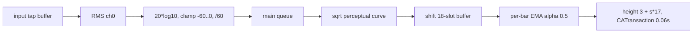

# Wispr Lightning — UI Specification, **v2 delta**

**Baseline:** `40532bf` (merge-base, what the Rust/Tauri port was built against).
**Target:** `origin/feature/backlog-sweep` (40 commits, +7,136 / −415 lines).

This document specifies **only what changed** in the UI between those two commits. It is a
companion to `docs/parity/ui-spec.md`, not a replacement: everything ui-spec.md describes that
is not contradicted below is still accurate. Where it *is* contradicted, this document says so
explicitly and names the exact line.

All numbers are macOS points (1pt = 1 CSS px at 1x). All quoted strings are verbatim from
source, including the U+2026 horizontal ellipsis (`…`), U+2715 (`✕`), U+26A0 U+FE0F (`⚠️`) and
U+26A0 (`⚠`). Anything not directly readable from source is marked `[INFERENCE]`.

**Files that did NOT change** (verified by `git diff --stat`): `UI/Theme.swift`,
`UI/DictionaryView.swift`, `UI/HistoryWindow.swift`, `UI/NotesView.swift`,
`UI/ToastNotification.swift`, `UI/AutoLayoutHelpers.swift`. ui-spec.md §1, §2, §5, §6, §7, §8
stand as written.

**Files that changed:** `UI/RecordingOverlay.swift` (+349), `UI/SettingsWindow.swift` (+1456),
`App/StatusBarController.swift` (+340), `App/AppDelegate.swift` (+808).
**New:** `UI/OnboardingWindow.swift` (440), `Services/PermissionsManager.swift` (164).

---

## 0. Corrections to the existing specs — read these first

### 0.1 `ui-spec.md` §4.5 and §10.14 are WRONG: there IS a level meter

> `ui-spec.md:319` — *"### 4.5 The pulse animation (there is NO waveform / level meter)"*
> `ui-spec.md:320` — *"**Important for parity:** the app has **no audio-level visualization, no bars, no waveform**."*
> `ui-spec.md:566` — *"14. **No audio level visualization exists.** If the Tauri port adds a waveform (a natural instinct), that is a *deviation*, not parity."*

All three statements were true at `40532bf` and are false at `origin/feature/backlog-sweep`.

The reference app grew an audio level meter **twice**:

1. **B-005 (commit `56a1bf8`)** added a red **ring `CALayer` behind the 10pt dot**, scaling
   1.0×–1.6× and fading 0–0.7 alpha with smoothed RMS. Fully specified in §1.3 below.
2. **Commit `8a81d74`** (the tip commit, *"Deepgram provider + VU bar pill + audio-never-lost
   hardening + lifecycle refactor"*) **replaced** the ring with an **18-bar VU strip** that is
   now the *entire* recording visual. Fully specified in §1.4.

The port must implement **#2**, the VU strip. #1 is documented because the assignment asked for
it, because it is the shape most people will describe when they say "B-005", and because it
tells you the design intent (perceptual curve, pulse suspension, reset-on-hide) that survived
into #2.

**A second, larger consequence:** at HEAD the pulsing red dot is *itself* gone. Every state
entry point sets `dotView?.isHidden = true` (see §1.5). The port's
`ui/src/overlay/overlay.css:120-159` — the `.dot` rule, the `wl-pulse` keyframes, and the
comment *"This is the app's entire recording visualisation: there is no waveform, no level
meter and no bars anywhere (OVL-031). Do not add one — it would be a new feature, not parity."*
— is now rendering something the reference app never shows.

### 0.2 `platform-spec.md` §205 and §404 are WRONG: newlines are Shift+Return

> `platform-spec.md:205` — *"`\n` → real Return, **virtual key 36**, flags `[]`."*
> `platform-spec.md:404` — *"…and Return (36) / Tab (48) in natural mode"*

At HEAD (`75000be`, first commit past the merge-base) `TextInjector.postCharacter` is:

```swift
// Bare Return submits in most chat apps (Slack, Discord, ChatGPT,
// Claude Code's prompt) and executes in shells, so dictating a
// newline would send the message early. Shift+Return is the
// "newline without submit" convention. Raw shells still submit on
// either form — that's a known limitation.
if ch == "\n" {
    postKey(virtualKey: UInt16(kVK_Return), flags: [.maskShift], source: source)
    return
}
if ch == "\t" {
    postKey(virtualKey: UInt16(kVK_Tab), flags: [], source: source)
    return
}
```

So: **`\n` → virtual key 36 with `flags = [.maskShift]`**. Tab is unchanged (vk 48, `flags = []`).
`CLAUDE.md` lists this under "Conventions and prior lessons" — it is load-bearing, not cosmetic.
Windows equivalent: `VK_RETURN` with `VK_SHIFT` held, **not** a bare `VK_RETURN`.

### 0.3 Related behavioural corrections the port also has wrong

| Claim in the port / old spec | Reality at HEAD | Source |
|---|---|---|
| Paste verification reads back 20 chars via AX | **Dropped entirely** (B-001, `518814e`). There is no `verifyPaste`. | BACKLOG B-001 |
| AX context works | **wontfix** (B-002, `181434a`). `kAXValueAttribute` is unset/non-string in essentially every modern app; the log reads `AX context: none` always. `useAccessibilityContext = true` is "aspirational". | BACKLOG B-002, CLAUDE.md |
| Natural Mode types to completion | **Esc cancels mid-stream** (`3ee01bb`). `NSEvent` global **and** local `.keyDown` monitors; the local monitor returns `nil` so Esc never reaches the focused app. Thread-safe `cancelLock` + `_cancelTyping`; the typing loop checks it between characters and logs `"Natural Mode: cancelled by Esc after \(typed)/\(text.count) chars"`. | `TextInjector.swift` |
| — | Natural Mode **also** aborts if the frontmost PID changes, checked every 8 characters: `"Natural Mode: focus changed mid-typing (pid A → B) — stopping after N/M chars"`. | `TextInjector.swift` |

---

## 1. The recording pill — `UI/RecordingOverlay.swift` (317 → 639 lines)

### 1.1 Window chrome — unchanged except corner radius derivation

`NSPanel`, initial content rect `120 × 36`, `[.nonactivatingPanel, .fullSizeContentView]`,
`.floating`, `isOpaque = false`, `backgroundColor = .clear`, `hasShadow = true`,
`isMovableByWindowBackground = false`, `collectionBehavior = [.canJoinAllSpaces, .stationary]`,
`animationBehavior = .utilityWindow`. Still shown with `orderFront(nil)`, **never**
`makeKeyAndOrderFront`. ui-spec §4.1 stands.

One change: `cornerRadius` is now `Self.pillHeight / 2` = **18** (was the literal `18`). Same
number; it is now a pill, by construction, at any height.

The content view is no longer a bare `NSVisualEffectView` — it is a private subclass
**`HoverEffectView`** that installs an `NSTrackingArea`
(`[.mouseEnteredAndExited, .activeAlways, .inVisibleRect]`) and forwards enter/exit to
`onMouseEntered` / `onMouseExited` closures. Material `.popover`, state `.active`,
`masksToBounds = true` — unchanged.

### 1.2 Geometry constants (all `private static let` on `RecordingOverlay`)

| Constant | Value | Meaning |
|---|---|---|
| `vuBarCount` | **18** | Number of VU bars |
| `vuBarWidth` | **3** | Bar width |
| `vuBarSpacing` | **2** | Gap between bars |
| `vuBarMinHeight` | **3** | Resting / silence height |
| `vuBarMaxHeight` | **20** | Height at level 1.0 |
| `vuStripHeight` | **22** | Height of the strip container view |
| `pillHeight` | **36** | Unchanged in every state |
| `recordingPillWidth` | **130** | Single width for Listening **and** Recording (was 120) |
| `cancelButtonSize` | **20** | Hover-revealed ✕ |
| `cancelButtonRightMargin` | **8** | Its inset from the trailing edge |

Derived: **strip width = 18 × 3 + 17 × 2 = 88**. The stack's edge insets are
`left = right = Theme.Spacing.large = 16`, leaving 98pt of content box in a 130pt pill — the
88pt strip fits with 5pt slack each side.

### 1.3 B-005 as originally shipped — the red ring (SUPERSEDED, do not build)

Commit `56a1bf8`. Documented for completeness; **superseded by §1.4**.

- `levelRing: CALayer` inserted at index 0 of `dotView.layer` (i.e. **behind** the dot).
- `frame = CGRect(x: -3, y: -3, width: 16, height: 16)` — a 16×16 box centred on the 10×10 dot,
  overhanging it by 3pt on every side.
- `cornerRadius = 8` (circle), `borderWidth = 1.5`,
  `borderColor = Theme.Colors.error.withAlphaComponent(0.5).cgColor` (systemRed @ 50%),
  `backgroundColor = NSColor.clear.cgColor`, `opacity = 0` at rest.
- `updateAudioLevel(_ level: Float)`:
  - **No-op** when `dotView.isHidden` (i.e. in Processing / Error / Retrying).
  - On the first update after a quiet period (`levelLastUpdate == nil`) it calls
    `stopPulsing()` so the 0.6s opacity pulse doesn't fight the ring. `levelLastUpdate = Date()`.
  - Smoothing: `smoothed = displayed * 0.6 + clamped * 0.4` — an **exponential moving average
    with α = 0.4**, applied once per callback.
  - **Scale 1.0×–1.6×:** `scale = 1.0 + CGFloat(smoothed) * 0.6`, applied as
    `CATransform3DMakeScale(scale, scale, 1)`.
  - **Alpha 0.0–0.7:** `opacity = Float(smoothed) * 0.7`.
  - Both inside `CATransaction` with `setAnimationDuration(0.05)` and
    `setDisableActions(false)` — so each 50 ms tick animates to its new value rather than
    snapping.
- `resetLevelRing()` — `removeAllAnimations()`, `opacity = 0`, `transform = identity`,
  `displayedLevel = 0`, `levelLastUpdate = nil`. Called from `hide()`, `showSpinner()`,
  `showRetrying()`, `configureErrorState()`, and from `show()` before re-arming.

### 1.4 The shipping level meter — the 18-bar VU strip

Commit `8a81d74`. **This is what the port must build.**

**Construction** (in `buildPanel()`): a plain `NSView` `strip`, `wantsLayer = true`, sized
`88 × 22`, holding 18 raw `CALayer`s (not subviews):

```swift
for i in 0..<18 {
    let bar = CALayer()
    let x = CGFloat(i) * (3 + 2)              // 0, 5, 10, … 85
    bar.anchorPoint = CGPoint(x: 0.5, y: 0)   // bottom-centre: Y growth is upward only
    bar.frame = CGRect(x: x, y: 0, width: 3, height: 3)
    bar.cornerRadius = 1.5                     // vuBarWidth / 2 → fully rounded caps
    bar.backgroundColor = Theme.Colors.error.cgColor
    strip.layer?.addSublayer(bar)
}
```

**Semantics.** The strip is a **scrolling history**, not a spectrum: bar *i* shows the *i*-th
entry of a rolling buffer of the last 18 level samples, **oldest on the left, newest on the
right**. New audio pushes the whole band leftwards.

**`updateAudioLevel(_ level: Float)`** — the only public entry point, called on the main queue:

1. `guard let strip = levelBarsView, !strip.isHidden, !levelBars.isEmpty else { return }`
   — a **no-op** whenever the strip is hidden (Processing, Inserting, Retrying, Error).
2. If `levelLastUpdate == nil`, call `stopPulsing()` (legacy carry-over from the ring;
   harmless at HEAD because the dot is always hidden). Then `levelLastUpdate = Date()`.
3. **Perceptual curve:** `clamped = max(0, min(1, level))`, then **`curved = sqrt(clamped)`**.
   Comment: *"Apply a mild perceptual curve so quiet speech (RMS ~0.1) still nudges the bars
   visibly instead of staying near the baseline."*
4. **Shift:** `for i in 0..<(count-1) { levelBuffer[i] = levelBuffer[i+1] }`, then
   `levelBuffer[last] = curved`.
5. **Per-bar smoothing and layout,** inside
   `CATransaction.begin()` / `setAnimationDuration(0.06)` / `setDisableActions(false)` / `commit()`:
   ```swift
   let target   = levelBuffer[i]
   let smoothed = displayedBarLevels[i] * 0.5 + target * 0.5   // EMA, α = 0.5, per bar
   displayedBarLevels[i] = smoothed
   let h = 3 + CGFloat(smoothed) * (20 - 3)                    // 3 … 20
   bar.frame.size.height = h
   ```
   Because `anchorPoint.y == 0`, the bar grows **up from the baseline**.

**`resetLevelBars()`** — refills `levelBuffer` and `displayedBarLevels` with
`Array(repeating: 0, count: 18)`, then inside `CATransaction` with
`setDisableActions(true)` sets every bar's height back to **3** and calls
`removeAllAnimations()`. Finally `levelLastUpdate = nil`. Called from `show()` (re-arm branch),
`hide()`, `showSpinner()`, `showRetrying()`, `configureErrorState()`.

**Colour.** Bars are `Theme.Colors.error` (`NSColor.systemRed`) in **Listening**, and are
recoloured to `NSColor.systemGreen` in **Recording (locked)**. Both `show()` and `hide()`
explicitly restore all 18 bars to red so a locked session can't leak green into the next one.

> **Latent-array note.** `levelBuffer` and `displayedBarLevels` are *declared* as
> `Array(repeating: 0, count: 5)` — a stale literal from an earlier 5-bar draft — while
> `vuBarCount` is 18. `resetLevelBars()` is what resizes them to 18. In the shipping app this
> is safe only because `AppDelegate` calls `recordingOverlay.prewarm()` at launch
> (`AppDelegate.swift:194`), so `show()` always takes the `panel != nil` branch, which calls
> `resetLevelBars()` before any level can arrive. `[INFERENCE]` Without prewarm the first
> `updateAudioLevel` would index `levelBuffer[5…17]` out of bounds and trap. The port should
> simply allocate 18 and not reproduce the hazard.

### 1.5 The dot and the pulse are now DEAD in every reachable state

The 10×10 `systemRed` dot (`cornerRadius 5`) and the `"pulse"` `CABasicAnimation`
(`opacity 1.0 → 0.3`, `duration 0.6`, `autoreverses`, `repeatCount .infinity`,
`easeInEaseOut`) are still *built* and still *exist*, but:

| Entry point | `dotView.isHidden` |
|---|---|
| `show()` (re-arm branch, the only reachable one) | `true` |
| `showLocked()` | `true` |
| `showSpinner()` — backs `showProcessing()` **and** `showInserting()` | `true` |
| `showRetrying(attempt:maxAttempts:)` | `true` |
| `configureErrorState(message:width:)` | `true` |
| `hide()` | `false` — but the panel is `orderOut`n on the next line |

`startPulsing()` is called from exactly one place: the `panel == nil` branch of `show()`, which
`prewarm()` makes unreachable. `mainLabel` is likewise hidden in `show()` and `showLocked()` —
**there is no `"Listening"` / `"Recording"` text on the pill any more.**

Source comment, verbatim:

> *"Listening / Recording states show ONLY the big VU band — no dot, no "Listening" text. The
> band is the indicator: bars moving = mic alive, bars jumping = voice detected."*

### 1.6 Content hierarchy at HEAD

`HoverEffectView` fills the panel. Inside it, an `NSStackView` pinned to all edges:

- `orientation = .horizontal`
- `spacing = Theme.Spacing.medium` = **8**
- `edgeInsets = (top: 0, left: 16, bottom: 0, right: 16)`
- **`distribution = .equalCentering`** — new. Comment: *"Force single-item centering even when
  only the strip is visible — the default gravity behavior was leaving the band left-aligned
  with empty space on the right."*
- `alignment = .centerY`

Arranged subviews, in order: **dot** (10×10) · **strip** (88×22) · **spinner**
(`NSProgressIndicator`, `.spinning`, `.small`, indeterminate, 16×16) · **mainLabel**
(`Theme.Fonts.body`, `labelColor`, initial `"Listening"`) · **timeLabel** (body,
`secondaryLabelColor`) · **retryButton** (`"Retry"`, `.rounded`, `.small`) · **saveButton**
(`"Save"`, `.rounded`, `.small`) · **dismissButton** (`"✕"` U+2715, `.inline`,
`isBordered = false`).

**Outside the stack**, added to the effect view *after* it (so it sits above the band):
the **cancel button** (§1.7).

### 1.7 New: hover-revealed cancel ✕ (recording states only)

A private `CancelButton: NSButton` subclass, **not** in the stack — it is absolutely positioned
so that showing/hiding it causes zero layout shift:

```swift
cancel.frame = NSRect(x: 130 - 20 - 8,          // 102
                      y: (36 - 20) / 2,          // 8
                      width: 20, height: 20)
cancel.autoresizingMask = .minXMargin           // stays trailing when the pill resizes
```

- **Image:** SF Symbol `xmark.circle.fill`,
  `NSImage.SymbolConfiguration(pointSize: 20, weight: .medium)`, `isTemplate = true`,
  `accessibilityDescription: "Cancel recording"`.
- `isBordered = false`, `bezelStyle = .inline`,
  `imageScaling = .scaleProportionallyDown`, `imagePosition = .imageOnly`, `title = ""`.
- **Tooltip:** `"Cancel recording"`.
- **Resting tint** `secondaryLabelColor`; **mouse-over tint** `labelColor`; cursor
  `NSCursor.pointingHand` via `cursorUpdate`. Tracking area options
  `[.mouseEnteredAndExited, .activeAlways, .inVisibleRect, .cursorUpdate]`.
- **Reveal:** `alphaValue`, never `isHidden`, animated by
  `NSAnimationContext.runAnimationGroup { ctx.duration = 0.12; … }` → `1` on pill hover-enter,
  `0` on hover-exit. Gated on `isRecordingMode`; when false the handler forces `alphaValue = 0`
  and returns.
- **`isRecordingMode`** is `true` only after `show()` / `showLocked()`, and `false` after
  `showSpinner()`, `showRetrying()`, `configureErrorState()`, `hide()`.
- **Click** → `guard isRecordingMode else { return }` then `onCancelAction?()`.

`AppDelegate` wires it at launch (`AppDelegate.swift:195`):

```swift
recordingOverlay.onCancelAction = { [weak self] in self?.cancelActiveRecording() }
```

`cancelActiveRecording()` → `guard isRecording`, logs `"User cancelled recording via pill ✕"`,
records an `AttemptRecord` with `outcome: .cancelled` if an attempt was in flight, then
`abortRecording(reason: "user cancel")`, which clears both audio callbacks, stops the recorder
**discarding packets**, `finishWriting()`s the on-disk PCM artifact (kept for next-launch
recovery), `dictationProvider.cancel()`, `statusBarController.setRecording(false)`,
`recordingOverlay.hide()`, and resumes music.

### 1.8 New state: **`"Inserting…"`**

```swift
func showProcessing() { showSpinner(label: "Processing", width: 145) }

/// Shown while text is being injected into the focused app — fast for the
/// clipboard path, several seconds in Natural Mode at slow speed. Call
/// before each `TextInjector.inject` so prior state (Retrying yellow,
/// error buttons) is cleared.
func showInserting()  { showSpinner(label: "Inserting…", width: 145) }
```

- Label is **`"Inserting…"`** with U+2026, not three periods.
- Width **145**, identical to Processing. Spinner visible and animating, dot hidden, VU strip
  hidden, cancel ✕ forced to alpha 0, `isRecordingMode = false`, `warningState = 0`, background
  tint cleared to `nil`, elapsed/Retry/Save/✕ all hidden.
- **Invariant (CLAUDE.md, load-bearing):** *"Pill state must be reset before each
  `TextInjector.inject` call. Call `recordingOverlay.showInserting()` first; otherwise prior
  states (Retrying yellow, error buttons) bleed through."*
- **All three inject call sites** in `AppDelegate.swift` comply — lines 829/830 (main
  dictation), 1292/1293 (polish), 1356/1357 (recovered-recording replay). Each is
  `showInserting()` immediately followed by `textInjector.inject(…)`, and each hides the pill in
  the completion.

### 1.9 Complete state table at HEAD

| State | Method | Width | Dot | VU strip | Spinner | Label | Cancel ✕ | Tint | Auto-dismiss |
|---|---|---|---|---|---|---|---|---|---|
| Hidden | `hide()` | — | hidden* | hidden, reset to 3pt, recoloured red | stopped | — | α 0 | — | `orderOut` |
| **Listening** | `show()` | **130** | **hidden** | **visible, red** | hidden | **hidden** | α 0, reveals on hover | none | no |
| **Recording (locked)** | `showLocked()` | **130** | **hidden** | **visible, green** | hidden | **hidden** | α 0, reveals on hover | none | no |
| Processing | `showProcessing()` | 145 | hidden | hidden | animating | `"Processing"` | α 0 | none | no |
| **Inserting** | `showInserting()` | 145 | hidden | hidden | animating | **`"Inserting…"`** | α 0 | none | no |
| Retrying | `showRetrying(attempt:maxAttempts:)` | 175 | hidden | hidden | animating | `"Retrying… (N/M)"` | α 0 | `systemYellow` @ 0.20 | no |
| Error (transient) | `showError(message:)` | 180 | hidden | hidden | hidden | the message | α 0 | `systemRed` @ 0.30 | **3000 ms** → `hide()` |
| Error (retryable, no Save) | `showRetryableError(… onSave: nil …)` | 260 | hidden | hidden | hidden | the message | α 0 | `systemRed` @ 0.30 | never |
| Error (retryable, with Save) | `showRetryableError(… onSave: non-nil …)` | 300 | hidden | hidden | hidden | the message | α 0 | `systemRed` @ 0.30 | never |
| Soft time warning | `showWarning()` | unchanged | — | — | — | — | — | `systemYellow` @ 0.30 | no |
| Final time warning | `showFinalWarning()` | unchanged | — | — | — | — | — | `systemRed` @ 0.30 | no |
| Elapsed visible | `updateElapsed(_:)` | **200** on first reveal | — | — | — | + separate time label | — | — | no |

\* `hide()` actually sets `dotView.isHidden = false` and restores its red fill, then
`orderOut`s the panel — the dot is never seen.

Still true from ui-spec §4: height is **36** in every state; positioning is
`x = visibleFrame.midX − width/2`, `y = visibleFrame.minY + 50`; `resizePanel(width:)` no-ops
when the width already matches; `show()` sets `currentPanelWidth = 0` first to force a
reposition; there is **no success/"Done" state**; `warningState` is monotonic 0→1→2 and is reset
by `show()`, `showLocked()`, `showProcessing()`, `showInserting()`; `updateElapsed` returns
immediately below 30 s and formats `"%d:%02d"` with `" ⚠️"` appended when `warningState > 0`;
Save flips its title to `"Saved"` and disables itself; `show()`/`hide()` clear all three
callbacks.

**Consequence of the new recording width:** the elapsed reveal at 30 s now jumps the pill
**130 → 200** (was 120 → 200), and because `mainLabel` is hidden in recording states, what the
user sees at 30 s is the VU band plus a bare `0:30`.

### 1.10 The RMS source — `AudioRecorder.onLevelUpdate`

New public surface on `AudioRecorder`:

```swift
/// 0.0–1.0 normalized RMS level. UI consumers must hop to the main queue.
var onLevelUpdate: ((Float) -> Void)?
```

Fired from inside the `installTap` callback (audio thread), *before* resampling:

```swift
let bufferSize = AVAudioFrameCount(Constants.chunkSamples)   // 640
inputNode.installTap(onBus: 0, bufferSize: bufferSize, format: hwFormat) { buffer, _ in
    if let cb = self.onLevelUpdate {
        cb(AudioRecorder.computeNormalizedLevel(from: buffer))
    }
    …
}
```

`computeNormalizedLevel(from:)`, verbatim behaviour:

1. `guard frameLength > 0 else { return 0 }`.
2. Sum of squares over **channel 0 only**. `floatChannelData` used directly; `int16ChannelData`
   scaled by `1.0 / 32768.0`. Any other format → **return 0**.
3. `rms = sqrtf(sumSquares / Float(frameLength))`.
4. `guard rms > 0 else { return 0 }`.
5. `db = 20.0 * log10f(rms)`; `clamped = max(-60.0, min(0.0, db))`;
   **`return (clamped + 60.0) / 60.0`** — i.e. **−60 dBFS → 0, 0 dBFS → 1**, linear in dB.

`AppDelegate` bridges to the UI (`AppDelegate.swift:513`):

```swift
audioRecorder.onLevelUpdate = { [weak self] level in
    DispatchQueue.main.async { self?.recordingOverlay.updateAudioLevel(level) }
}
```

and sets `audioRecorder.onLevelUpdate = nil` on every teardown path (`abortRecording`,
`stopRecording`, and the `.failed` branch of `audioRecorder.start()`).

**Update rate.** `Constants.chunkSamples = 16000 * 40 / 1000 = 640`. The tap requests 640
frames **at the hardware format**, not at 16 kHz. `[INFERENCE]` on a 48 kHz input that is
13.3 ms (~75 Hz), and AVAudioEngine additionally rounds the tap buffer to its own granularity;
the source's own comments claim *"~25 Hz"* in two places. The port already produces exactly one
640-sample / 40 ms frame at 16 kHz per packet, so **driving the meter at that cadence gives a
clean, deterministic 25 Hz** and matches the smoothing constants, which were tuned against the
25 Hz assumption. Recommend 25 Hz; do not attempt to reproduce the hardware-dependent rate.

So the full chain is:



### 1.11 What the Rust port must change — pill

1. **Delete the `.dot` element, the `wl-pulse` keyframes, and the OVL-031 comment** in
   `ui/src/overlay/overlay.css`. They render a visual the reference app no longer has.
2. **Add the 18-bar VU strip.** 18 bars × 3px wide, 2px gaps (88px total), 22px container,
   3px min / 20px max height, `border-radius: 1.5px`, growing from a bottom baseline
   (`transform-origin: bottom` or `align-items: flex-end`). Red (`--danger`/systemRed) in
   Recording, green (`--success`/systemGreen) in Locked.
3. **Add an `overlay:level` event** carrying `f32` 0–1, emitted at 25 Hz from the audio frame
   path, computed as `20*log10(rms)` clamped to `[-60, 0]` then `/60`. Apply `sqrt()`, shift a
   18-slot ring buffer (newest right), per-bar EMA α = 0.5, and transition height over 60 ms.
4. **Reset the bars** (all to 3px, buffer zeroed, colour back to red) on hide and on every
   non-recording state entry, and **no-op** the level handler while the strip is hidden.
5. **Remove the `"Listening"` / `"Recording"` label text from those two states.** The band is
   the entire indicator.
6. **Change the recording width 120 → 130** for both Recording and Locked.
7. **Add the `Inserting` state**: label `"Inserting…"` (U+2026), width 145, spinner, no bars.
   Emit it from the Rust pipeline immediately before every injection call, and make it a
   pipeline invariant that no injection happens without it.
8. **Add the hover-revealed cancel ✕**: absolutely positioned 20×20 at
   `right: 8px; top: 8px`, `xmark.circle.fill`-equivalent glyph, opacity 0↔1 over **120 ms** on
   pill hover, pointer cursor, tint `secondary → primary` on its own hover, tooltip
   `"Cancel recording"`, visible only in Recording/Locked. Clicking must invoke a `cancel_recording`
   IPC command that discards audio, keeps the on-disk PCM artifact, and hides the pill.
   **Critical:** the overlay window is non-activating — the ✕ must receive clicks without the
   window taking focus (this is the same `WS_EX_NOACTIVATE` invariant already documented in
   ui-spec §10.3, now with a second clickable control depending on it).
9. `ui/src/overlay/state.ts` needs `Inserting` added to `OverlayState` / `StateKey`, `recording`
   and `locked` widths changed to 130, and the `label` for `recording`/`locked` set to `""`.

---

## 2. The Onboarding wizard — `UI/OnboardingWindow.swift` (new, 440 lines)

B-010 (`776bf15`) created it as a single permissions page; B-016 (`d0370a5`) turned it into a
3-step paged flow and B-017 added the mic-test step. `df0350f` added the focus fix.
**The port has nothing equivalent.**

### 2.1 When it is shown

`AppDelegate.applicationDidFinishLaunching`, line 325:

```swift
// Onboarding wizard: auto-show whenever a required permission is
// missing, or on first launch (didCompleteOnboarding == false).
let requiredOk = PermissionsManager.allRequiredGranted()
if !requiredOk || !settings.didCompleteOnboarding {
    showOnboarding()
}
```

Immediately followed by a log line:
`"Permissions on launch — mic=<s> input=<s> ax=<s> screen=<s>"`.

`AppSettings.didCompleteOnboarding: Bool = false` is a new persisted key. It is set to `true`
**only** by the footer button on the final step:

```swift
self.settings.didCompleteOnboarding = true
self.settings.save()
self.window?.close()
self.stopObservingActivation()
self.restorePolicy()
self.onCompleted()
```

`onCompleted` logs `"Onboarding completed"` and nils the controller.

> **Closing the window with the red ✕ does NOT set `didCompleteOnboarding`.** The style mask is
> `[.titled, .closable, .miniaturizable]`, so the user can dismiss it — and it comes straight
> back on the next launch. That is the only "Skip" affordance in the wizard; there is no Skip
> button.

Re-entry: the status-bar item **`"Setup & Permissions…"`** (§4) calls
`StatusBarController.onShowOnboarding` → `AppDelegate.showOnboarding()`. The controller is
lazily created and reused; a second `show()` just does
`makeKeyAndOrderFront(nil)` + `NSApp.activate(ignoringOtherApps: true)`.

### 2.2 Window

| Property | Value |
|---|---|
| Title | **`"Welcome to Wispr Lightning"`** |
| `setContentSize` | `480 × 600` |
| Style mask | `[.titled, .closable, .miniaturizable]` — **not resizable** |
| Position | `win.center()` |
| `isReleasedWhenClosed` | `false` |
| Root view frame | **`.frame(width: 520, height: 640)`** |

`[INFERENCE]` The SwiftUI root's intrinsic 520×640 wins over the 480×600 `setContentSize`
because `NSHostingController` propagates its content size, so the effective window is
**520 × 640**. Build the port at 520×640.

**Focus handling (part of `df0350f`, see §5.6):** on `show()` the controller calls
`promoteToRegular()` — snapshots `NSApp.activationPolicy()` and sets `.regular` — and installs
an `NSApplication.didBecomeActiveNotification` observer that re-issues
`window.makeKeyAndOrderFront(nil)` on every reactivation. Comment:

> *"Granting a permission yanks focus to the OS prompt / System Settings. When the user comes
> back, our window can get buried — re-raise it on every reactivation until onboarding is
> dismissed."*

Both are torn down on completion (`restorePolicy()` restores the prior policy unless it was
already `.regular`).

### 2.3 Chrome shared by all three steps

Root `VStack(spacing: 18)`, `.padding(.top, 20)`:

1. `Image(systemName: "bolt.fill")`, `.font(.system(size: 48))`, foreground
   `LinearGradient(colors: [.yellow, .orange], startPoint: .top, endPoint: .bottom)`,
   `.frame(width: 60, height: 60)`.
2. `Text("Welcome to Wispr Lightning")`, `.font(.title.bold())`.
3. **Step dots** — `HStack(spacing: 8)` of 3 `Circle()`s, each `8 × 8`, filled
   `Color.orange` when `i == step.rawValue`, else `Color.secondary.opacity(0.3)`.
4. The current page, `.frame(maxWidth: .infinity, maxHeight: .infinity)`.
5. The footer.

`private enum OnboardingStep: Int { case permissions = 0, mic, vendor }`.

### 2.4 Footer (Continue / Back)

`VStack(spacing: 6)`, `.padding(.bottom, 16)`; the button row has `.padding(.horizontal, 20)`.

- **Back** — `Button("Back")`, shown on every step **except** `.permissions`. Decrements the step.
- **Spacer()**
- **Primary button** — `.keyboardShortcut(.defaultAction)` (Return, blue default styling),
  label `.frame(minWidth: 140).padding(.vertical, 2)`. Advances one step; on the last step calls
  `onContinue()` (which sets `didCompleteOnboarding` and closes).

| Step | Primary label | Enabled |
|---|---|---|
| `.permissions`, all required granted | **`"Continue"`** | yes |
| `.permissions`, something missing | **`"Continue (some permissions missing)"`** | **`.disabled(true)`** |
| `.mic` | **`"Continue"`** | yes |
| `.vendor` | **`"Finish setup"`** | yes |

Note the label is deliberately self-contradictory: it says "some permissions missing" while
being disabled. Below the row, only while on `.permissions` and not all granted:

> `Text("Grant Microphone, Input Monitoring, and Accessibility to continue.")` — `.caption`, `.secondary`

`nextEnabled` for `.mic` and `.vendor` is `true`; the `.disabled` modifier only applies on
`.permissions`. **There is no Skip on any step.**

### 2.5 Step 1 — Permissions

`VStack(spacing: 14)`:

- Blurb, `.multilineTextAlignment(.center)`, `.secondary`, `.padding(.horizontal, 24)`:
  > **`"Grant the permissions Lightning needs to listen for your hotkey and type transcripts at the cursor."`**
- `VStack(spacing: 10)`, `.padding(.horizontal, 20)`, one `PermissionRow` per
  `Permission.allCases`, **in declaration order**: `microphone`, `inputMonitoring`,
  `accessibility`, `screenRecording`. Status comes from
  `poller.statuses[p] ?? .notDetermined`.

**`PermissionRow`** — `HStack(spacing: 12)`, `.padding(12)`,
`.background(Color(NSColor.controlBackgroundColor))`, `.cornerRadius(8)`:

1. Status glyph — `.font(.title2)`, `.frame(width: 24)`:

   | Status | SF Symbol | Colour |
   |---|---|---|
   | `.granted` | `checkmark.circle.fill` | `.green` |
   | `.notDetermined` | `exclamationmark.circle.fill` | `.orange` |
   | `.denied` | `xmark.circle.fill` | `.red` |

2. `VStack(alignment: .leading, spacing: 2)`:
   - `HStack(spacing: 6)`: title `.font(.body.bold())`; then, **only when
     `!permission.isRequired`**, an `"Optional"` chip — `.font(.caption2)`,
     `.padding(.horizontal, 6)`, `.padding(.vertical, 2)`,
     `.background(Color.secondary.opacity(0.18), in: Capsule())`, `.foregroundStyle(.secondary)`.
   - rationale — `.font(.footnote)`, `.secondary`, `.fixedSize(horizontal: false, vertical: true)`.
3. `Spacer()`
4. If `.granted` → `Text("Granted")`, `.caption`, `.green`.
   Otherwise → `Button(status == .denied ? "Open Settings" : "Grant")`, `.controlSize(.small)`,
   action `PermissionsManager.requestAccess(permission, currentStatus: status)`.

**The four permissions, verbatim:**

| `Permission` | `title` | `rationale` | `isRequired` |
|---|---|---|---|
| `.microphone` | **`"Microphone"`** | **`"Record your voice for dictation."`** | ✅ |
| `.inputMonitoring` | **`"Input Monitoring"`** | **`"Listen for your global push-to-talk hotkey when other apps are focused."`** | ✅ |
| `.accessibility` | **`"Accessibility"`** | **`"Paste transcripts at the cursor and type characters in Natural Mode."`** | ✅ |
| `.screenRecording` | **`"Screen Recording"`** | **`"Optional — read on-screen text as transcription context. macOS will quit Wispr Lightning after you grant this; relaunch from /Applications."`** | ❌ |

**Status probes** (`PermissionsManager.status(_:)`):

| Permission | Probe | Mapping |
|---|---|---|
| Microphone | `AVCaptureDevice.authorizationStatus(for: .audio)` | `.authorized`→granted; `.notDetermined`→notDetermined; `.denied`/`.restricted`/unknown→denied |
| Input Monitoring | `IOHIDCheckAccess(kIOHIDRequestTypeListenEvent)` | `kIOHIDAccessTypeGranted`→granted; `kIOHIDAccessTypeDenied`→denied; else notDetermined |
| Accessibility | `AXIsProcessTrusted()` | true→granted; false→**notDetermined** (macOS conflates not-asked and denied) |
| Screen Recording | `CGPreflightScreenCaptureAccess()` | true→granted; false→notDetermined |

**Grant actions** (`requestAccess(_:currentStatus:)`) — if `currentStatus == .denied`, it
*only* opens System Settings (the OS won't re-prompt). Otherwise:

| Permission | Action |
|---|---|
| `.microphone` | `AVCaptureDevice.requestAccess(for: .audio) { _ in }` |
| `.inputMonitoring` | `IOHIDRequestAccess(kIOHIDRequestTypeListenEvent)` **then** open System Settings |
| `.accessibility` | `AXIsProcessTrustedWithOptions([kAXTrustedCheckOptionPrompt: true])` **then** open System Settings |
| `.screenRecording` | `CGRequestScreenCaptureAccess()` |

**Deep links** (`systemSettingsURL`, opened via `NSWorkspace.shared.open`):

```
x-apple.systempreferences:com.apple.preference.security?Privacy_Microphone
x-apple.systempreferences:com.apple.preference.security?Privacy_ListenEvent
x-apple.systempreferences:com.apple.preference.security?Privacy_Accessibility
x-apple.systempreferences:com.apple.preference.security?Privacy_ScreenCapture
```

**`PermissionStatusPoller`** — `ObservableObject`, `@Published private(set) var statuses`.
`refresh()` on init, then a repeating `Timer` at **1.0 s**. It re-reads all four and **only
republishes when the snapshot dictionary changes** (`if next != statuses`). Invalidated in
`deinit`. `allRequiredGranted` = all of `{microphone, inputMonitoring, accessibility}` are
`.granted`. Comment: *"macOS doesn't notify on TCC grants, so we re-read every second."*

### 2.6 Step 2 — Mic test (B-017)

`VStack(spacing: 14)`:

- `Text("Test your microphone")`, `.font(.title3.weight(.semibold))`
- Blurb, centred, `.secondary`, `.padding(.horizontal, 24)`:
  > **`"Say something — you should see the bar move. If it stays flat, switch to a different input device or check your system input settings."`**
- `MicTestView(settings: settings)`, `.padding(.horizontal, 20)`

**`MicTestView`** — `VStack(spacing: 12)`, `.padding(.horizontal, 4)`, `start()` on appear,
`stop()` on disappear.

*Conflict branch* — when `AudioRecorder.isAnyActive` at start time:

- `HStack(spacing: 8)`: `Image(systemName: "waveform.badge.exclamationmark")` `.orange`; then
  `Text("A dictation is in progress — skip this step and test the mic after.")`, `.callout`,
  `.secondary`.
- `.padding(12)`, `.background(Color.orange.opacity(0.12), in: RoundedRectangle(cornerRadius: 8))`.

*Normal branch* — a horizontal level bar:

- `ZStack(alignment: .leading)`:
  - Track: `Capsule().fill(Color.secondary.opacity(0.15))`, **height 24**.
  - Fill: `Capsule().fill(LinearGradient(colors: [.green, .yellow, .red], startPoint: .leading, endPoint: .trailing))`,
    **height 24**, `width = geo.size.width * CGFloat(min(1, level * 1.6))` — note the **1.6×
    gain** so the bar saturates at level 0.625, `.animation(.linear(duration: 0.05), value: level)`.
- Caption, `.font(.caption)`:
  - `level < 0.02` → **`"No signal yet — try speaking, or check your input device."`**, `.secondary`
  - otherwise → **`"Looks good — Lightning hears you."`**, `.green`

`start()`: bails to the conflict branch if `AudioRecorder.isAnyActive`; else constructs
`AudioRecorder(settings: settings)` using the **live** settings instance (comment: *"AppSettings
is effectively a singleton — a second `.load()` would create a parallel instance that doesn't
observe future settingsChanged notifications"*), sets `onLevelUpdate` to hop to main and assign
`level`, and calls `r.start()`.
`stop()`: nils `onLevelUpdate`, `stop()`, `cleanup()`, releases the recorder.

### 2.7 Step 3 — Vendor pick (B-016)

**`VendorPickView`**, `VStack(spacing: 14)`:

- `Text("Pick a transcription provider")`, `.font(.title3.weight(.semibold))`
- Blurb, centred, `.secondary`, `.padding(.horizontal, 24)`:
  > **`"You can change this any time in Settings → Provider. Add fallbacks there too."`**
- `VStack(spacing: 10)`, `.padding(.horizontal, 20)`, one `VendorChoice` per
  `DictationVendor.allCases` in declaration order: **Wispr Flow, OpenRouter, Claude Voice,
  Deepgram**.
- Initial selection: `DictationVendor.wisprFlow.rawValue` (`"wispr_flow"`).
- `.onChange(of: selected)` → `let s = AppSettings.load(); s.activeVendor = newValue; s.save()`.

> **Bug worth not porting:** this writes through a *freshly loaded* `AppSettings`, not the live
> instance the rest of the app holds — the opposite of what `MicTestView` was explicitly fixed
> to avoid. The port should write to the single shared settings store.

**`VendorChoice`** — a `Button` with `.buttonStyle(.plain)`, whose label is
`HStack(spacing: 12)`, `.padding(12)`, `.cornerRadius(8)`, background
`Color.accentColor.opacity(0.12)` when selected else `Color(NSColor.controlBackgroundColor)`:

1. Radio glyph — `largecircle.fill.circle` when selected (`.accentColor`) else `circle`
   (`.secondary`), `.font(.title2)`.
2. `VStack(alignment: .leading, spacing: 2)`: `vendor.displayName` `.font(.body.bold())`; then
   the rationale `.font(.footnote)` `.secondary` `.fixedSize(horizontal: false, vertical: true)`.
3. `Spacer()`

**Rationale strings, verbatim:**

| Vendor | `displayName` | Rationale |
|---|---|---|
| `.wisprFlow` | `Wispr Flow` | **`"Sign in with your Wispr Flow account. Best transcription quality plus the Polish feature."`** |
| `.openRouter` | `OpenRouter` | **`"BYO API key. Pay OpenRouter directly for any audio-input model (Gemini, Whisper, etc.). Set up in Accounts."`** |
| `.claudeVoice` | `Claude Voice` | ``"Uses the `claude` CLI's stored credentials. Live streaming. Run `claude /login` once if you haven't."`` |
| `.deepgram` | `Deepgram` | **`"BYO API key. Pay Deepgram directly ($0.0048/min for Nova-3, $200 free credit). Set up in Accounts."`** |

### 2.8 What the Rust port must change — Onboarding

**Status: entirely missing.** Build:

1. A `onboarding` Tauri window, 520×640, non-resizable, titled
   `"Welcome to Wispr Lightning"`, centred, closable.
2. A `did_complete_onboarding: bool` setting (default `false`) and launch-time logic:
   show the wizard when **any required permission is missing OR
   `!did_complete_onboarding`**. Only the final-step button sets the flag; closing the window
   must not.
3. A cross-platform permissions model. macOS maps to the four TCC probes above. Windows has no
   TCC — `[INFERENCE]` the honest port shows Microphone only (via the WinRT/WASAPI capture
   consent path) and drops the other three rows rather than faking them; the "all required
   granted" gate then reduces to Microphone.
4. A **1 Hz poller** that re-reads status and only re-emits on change (macOS cannot notify on
   grant).
5. The 3-step paged flow with the 8px orange/grey step dots, all strings verbatim.
6. The mic-test bar: 24px capsule, green→yellow→red horizontal gradient, width
   `min(1, level*1.6)`, 50 ms linear transition, 0.02 threshold for the two caption strings.
   Reuse the same `overlay:level` plumbing added for the pill (§1.11).
7. Vendor pick writing `active_vendor` to the shared settings store immediately on selection.

---

## 3. Settings window restructure — `UI/SettingsWindow.swift` (1435 → 2702 lines)

### 3.1 Window chrome — two additions

Everything in ui-spec §3.1 stands (860×580, min 680×460, title
`"Wispr Lightning Settings"`, `.unified` toolbar, autosave name `"SettingsWindow"`,
`isReleasedWhenClosed = false`, view model built once per window instance). New:

```swift
// Hide the window from the cmd-h / cmd-w "everything closes" sweep so
// a stray hotkey doesn't lose the user's place mid-setup.
w.collectionBehavior = [.fullScreenAuxiliary, .moveToActiveSpace]
w.delegate = self
```

`SettingsWindowController` is now `NSObject, NSWindowDelegate` and implements the focus fix
described in §5.6.

Also new: a **Cmd+,** local `NSEvent` monitor installed in `AppDelegate`
(`AppDelegate.swift:317`) that swallows the event and calls
`statusBarController.openSettings()`.

### 3.2 Sidebar — new sections, new order, conditional Polish

`SettingsSection` gains **`.accounts`** and **`.provider`**. Full enum, in declaration order:

```swift
case general, dictation, accounts, provider, polish
case history, dictionary, notes
case privacy, system
```

| Section | Title | SF Symbol | Gradient |
|---|---|---|---|
| `.general` | `General` | `gearshape.fill` | Gray `#A3A3B3`→`#7A7A8C` |
| `.dictation` | `Dictation` | `mic.fill` | Blue `#4D91FF`→`#2461F5` |
| **`.accounts`** | **`Accounts`** | **`person.crop.circle.fill`** | **Blue** (same as Dictation) |
| **`.provider`** | **`Provider`** | **`antenna.radiowaves.left.and.right`** | **Green** `#57D170`→`#33B34D` |
| `.polish` | `Polish` | `sparkles` | Purple `#B861FF`→`#8C38F0` |
| `.history` | `History` | `clock.fill` | Orange `#FFAD38`→`#FA8005` |
| `.dictionary` | `Dictionary` | `character.book.closed.fill` | Green (same as Provider) |
| `.notes` | `Notes` | `note.text` | Yellow `#FFD62E`→`#FAB30A` |
| `.privacy` | `Privacy` | `hand.raised.fill` | Blue |
| `.system` | `System` | `desktopcomputer` | Gray |

The raw gradient stops are unchanged from ui-spec §3.3; Provider reuses the existing Green pair
rather than introducing a new hue.

**Groups** (three unlabeled `Section`s, separator gaps, no headers):

1. `[.general, .dictation, .accounts, .provider]` **+ `.polish` only when
   `session.canUsePolish(activeVendor:)`**
2. `[.history, .dictionary, .notes]`
3. `[.privacy, .system]`

```swift
/// Polish is a Wispr Flow-only feature; hide the tab entirely for other vendors.
private var settingsGroup: [SettingsSection] {
    let vendor = DictationVendor(rawValue: vm.activeVendor) ?? .wisprFlow
    return session.canUsePolish(activeVendor: vendor)
        ? [.general, .dictation, .accounts, .provider, .polish]
        : [.general, .dictation, .accounts, .provider]
}
```

`Session.canUsePolish(activeVendor:)` = `activeVendor == .wisprFlow && isWisprFlowAccount`.
So the **entire Polish sidebar row disappears** unless Flow is the active vendor *and* a Flow
session is loaded. Everything else in the sidebar — 220pt column, 64×64 `WisprFlowIcon.png`
clipped to `cornerRadius 14` with `.padding(.top, 16)` / `.padding(.bottom, 8)`,
`.listStyle(.sidebar)`, `SectionIcon` 28×28 `cornerRadius 7` tiles with a 13pt semibold white
glyph, rows `.padding(.vertical, 1)`, default selection `.general` — is unchanged.

**Detail routing** — `.history` / `.dictionary` / `.notes` fill edge-to-edge; everything else is
`ScrollView { VStack(alignment: .leading, spacing: 16) { … }.padding(28) }`:

| Section | Panes, in order |
|---|---|
| `.general` | `ShortcutsDetail` · `Divider()` · `MicrophoneDetail` · `Divider()` · `LanguagesDetail` |
| `.dictation` | `DictationDetail` · `Divider()` · `PersonalizationDetail` |
| **`.accounts`** | `AccountsDetail` |
| **`.provider`** | `ProviderDetail` |
| `.polish` | `PolishDetail` |
| `.privacy` | `PrivacyDetail` |
| `.system` | `SystemDetail` |

> **The `"Account"` group is GONE from General.** ui-spec §3.5 lists Account as General's first
> group. Commit `121db03` moved the Wispr Flow account UI to Settings → Provider; commit
> `480c6ed` then split all per-vendor auth into the dedicated **Accounts** tab. General now
> starts at "Dictation Hotkeys".

### 3.3 Tab: **General** — Shortcuts panel (unchanged parts + three new blocks)

Header `Text("Dictation Hotkeys").font(.title3.weight(.semibold))`, one `GroupBox` with an inner
`VStack(alignment: .leading, spacing: 8)` and `.padding(8)`.

Unchanged: the `"Any of these keys will start dictation:"` line, the `KeyCapView` rows with the
`minus.circle` red borderless remove button (tooltip **`"Remove this hotkey"`**, shown only when
`count > 1`), the **`"Add Hotkey"`** / **`"Press a key…"`** capture button (`controlSize .small`),
and the footer `"Modifier keys work as hold-to-talk. Regular keys use press-to-toggle."`
(`.subheadline`, `.tertiary`).

Then, new, in order:

**`Divider()`**

#### 3.3.1 B-014 — `HotkeyConflictTester` ("Test your hotkey")

`VStack(alignment: .leading, spacing: 6)`:

- `Text("Test your hotkey")` — `.font(.subheadline.weight(.medium))`
- `HStack(spacing: 10)`:
  - `ZStack`:
    - `Capsule().fill(matched ? Color.green.opacity(0.18) : Color.secondary.opacity(0.10))`,
      **`.frame(width: 220, height: 28)`**
    - `Text(label)` — `.font(.caption.monospaced())`, `.green` when matched else `.secondary`
  - When matched: `Image(systemName: "checkmark.seal.fill")`, `.green`

**Label strings, verbatim:**

| Condition | Text |
|---|---|
| nothing seen yet | **`"Press your hotkey to confirm Lightning sees it…"`** (U+2026) |
| a bound keycode arrived | **`"Detected: <name>"`** |
| some other key arrived | **`"Saw <name> (not your bound hotkey)"`** |

`<name>` = `HotkeyListener.keycodeLabels[code]` (the 13-entry map in ui-spec §3.5) else
**`"Key <code>"`**.

`matched` is a computed property: `Date().timeIntervalSince(matchedAt) < 1.5` — the green
capsule and seal **decay after 1.5 s**. `matchedAt` is set only on a bound-keycode hit; the
"Saw X" text has no timeout and persists.

Implementation: `NSEvent.addLocalMonitorForEvents(matching: [.flagsChanged, .keyDown])`
installed `.onAppear`, removed `.onDisappear`. The monitor **returns the event** (does not
swallow it).

Caveat text directly below the tester, `.font(.caption)`, `.tertiary`:

> **`"Some hotkeys are claimed by macOS or other apps (e.g. Fn opens dictation; ⌥-space is Spotlight on some configs). If your hotkey is intercepted, Lightning won't see the press — pick something else."`**

**`Divider()`**

#### 3.3.2 B-015 — Press behavior radio group

`VStack(alignment: .leading, spacing: 6)`:

- `Text("Press behavior")` — `.font(.subheadline.weight(.medium))`
- `Picker` with `.labelsHidden()` and **`.pickerStyle(.radioGroup)`**, bound to
  `vm.hotkeyPressBehavior`:

  | Label | Tag |
  |---|---|
  | **`"Hold to talk"`** | `"hold"` |
  | **`"Tap to start, tap to stop"`** | `"toggle"` |
  | **`"Hold or double-tap to lock (legacy)"`** | `"legacy"` |

  `.onChange` → `vm.saveHotkeyPressBehavior()`.
- Hint text for the current selection — `.font(.caption)`, `.tertiary`,
  `.fixedSize(horizontal: false, vertical: true)`:

  | Value | Hint |
  |---|---|
  | `"hold"` | **`"Recording lasts as long as the key is held. Releasing always ends it."`** |
  | `"toggle"` | **`"Press once to start, press again to stop. Holding still works as push-to-talk."`** |
  | anything else (`"legacy"`) | **`"Quick tap waits for a second tap to lock hands-free. Hold longer than ~0.5s for push-to-talk."`** |

**Setting:** `AppSettings.hotkeyPressBehavior: String = "legacy"` (new).
`saveHotkeyPressBehavior()` also keeps the deprecated bool in sync:
`settings.hotkeyTapToToggle = (hotkeyPressBehavior == "toggle")`.

**Migration** (`AppSettings.applyMigrations`, runs on every load):

```swift
if settings.hotkeyPressBehavior.isEmpty {
    settings.hotkeyPressBehavior = settings.hotkeyTapToToggle ? "toggle" : "legacy"
}
```

B-011 (`5ce7784`) shipped `hotkeyTapToToggle: Bool = false` as a plain toggle row first; B-015
replaced that row with this 3-way picker and demoted the bool to a compat field. The port must
implement the **picker**, not the bool.

#### 3.3.3 Hotkey capture — new cross-conflict alerts

`startCapturing()` still installs a local `[.keyDown, .flagsChanged]` monitor, still requires a
*press* (not release) for `flagsChanged`, still silently cancels on a duplicate keycode. New:
if the pressed keycode is already in `polishHotkeyKeyCodes`, a modal `NSAlert` with one `"OK"`
button:

- messageText **`"That key is already your Polish hotkey"`**
- informativeText **`"Pick a different key for dictation, or change Polish's binding first."`**

And the mirror, in `startCapturingPolishHotkey()` when the keycode is in `hotkeyKeyCodes`:

- messageText **`"That key is already your dictation hotkey"`**
- informativeText **`"Pick a different key for Polish so the two don't conflict."`**

### 3.4 Tab: General — Input Device and Languages

**Unchanged.** `MicrophoneDetail` is header `"Input Device"` + the `System Default`-first mic
`Picker`, the `Label("Refresh", systemImage: "arrow.clockwise")` button, a `Divider()`, and the
`"Keep microphone active"` / `"Eliminates startup delay — recommended when using iPhone as
microphone"` toggle. `LanguagesDetail` is byte-for-byte the ui-spec §3.5 language panel
(104 rows, auto-detect exclusivity, 220pt list, 28pt bottom fade). No changes.

### 3.5 Tab: Dictation

**Unchanged.** `DictationDetail` and `PersonalizationDetail` match ui-spec §3.5 exactly —
same 12 controls, same defaults, same dependencies, same `"Slow ≈ 30 WPM, Normal ≈ 50 WPM,
Expert ≈ 80 WPM"` caption.

### 3.6 Tab: **Provider** (new) — the transcription chain

`ProviderDetail`, a `VStack(alignment: .leading, spacing: 16)`. `.onAppear` →
`vm.loadOpenRouterModels()`.

1. `Text("Transcription Chain")` — `.font(.title3.weight(.semibold))`
2. Explainer — `.font(.callout)`, `.secondary`:
   > **`"Step 1 is your primary provider. If it fails with a hard error (auth, network, server, timeout), Lightning automatically retries the same audio against step 2, then step 3, and so on. Empty transcripts don't fall through. Set up vendor credentials in the Accounts tab."`**
3. The **primary row** (§3.6.1)
4. Zero or more **fallback step rows** (§3.6.2), `ForEach` over `vm.fallbackChain`
5. `Button("+ Add fallback")`, `.controlSize(.small)`

Both row kinds share the same shell: `HStack(alignment: .top, spacing: 10)`, `.padding(10)`,
`.background(Color(NSColor.controlBackgroundColor))`, `.cornerRadius(8)`, leading index label
`.font(.body.monospacedDigit())` `.secondary` `.frame(width: 26, alignment: .trailing)`.

#### 3.6.1 Primary row (step **`"1."`**)

- **Vendor picker** — `.labelsHidden()`, `.pickerStyle(.menu)`,
  `.frame(maxWidth: 280, alignment: .leading)`, bound to `vm.activeVendor`, options =
  `DictationVendor.allCases` by `displayName`: **Wispr Flow · OpenRouter · Claude Voice ·
  Deepgram**. `.onChange` → `vm.saveActiveVendor()` (writes `settings.activeVendor` + `save()`).
- **`VendorReadinessBadge`** immediately to its right (§3.6.3).
- **Model picker, only when `activeVendor == "openrouter"`** — `.labelsHidden()`,
  `.pickerStyle(.menu)`, `.frame(maxWidth: 420, alignment: .leading)`, bound to
  `vm.openRouterModel`:
  - when `openRouterModelListState == .loaded`: one row per fetched model labelled
    `m.displayLabel`; **plus** a `"Custom: <id>"` row when the stored id isn't in the list.
  - otherwise: a single **disabled** row **`"Loading models…"`** with tag
    `"loading-placeholder"`.
  - `.onChange` → `vm.saveProviderSettings()` (persists `activeVendor` + trimmed
    `openRouterModel`, posts `.settingsChanged`).
- `Spacer()`
- A single **`chevron.down`** borderless button → `vm.demotePrimary()`. Tooltip is conditional:
  - chain empty → **`"Move primary down (appends a new fallback step)"`**
  - otherwise → **`"Move primary down — swap with the first fallback"`**

There is deliberately **no remove and no move-up** on the primary.

#### 3.6.2 Fallback step rows (steps **`"2."`**, `"3."`, …)

Index label is `"\(index + 2)."`. Same vendor picker (280pt cap) + readiness badge.

- **Model picker, only when `step.vendor == "openrouter"`** — 420pt cap, bound to
  `step.openRouterModel ?? ""`:
  - first row **`"Use primary OpenRouter model"`** with tag `""` (empty → stored as `nil`)
  - then the fetched models, or the disabled `"Loading models…"` row
  - plus `"Custom: <id>"` when the step's stored id isn't in the list
- Trailing `HStack(spacing: 4)` of borderless buttons:
  - **`chevron.up`**, tooltip **`"Move up"`** — always present. For `index == 0` it calls
    `vm.promoteToPrimary(at: 0)` (swaps with the primary); otherwise
    `vm.moveFallbackStep(from: index, to: index - 1)`.
  - **`chevron.down`**, tooltip **`"Move down"`** — present only when
    `index < fallbackChain.count - 1`; calls `vm.moveFallbackStep(from: index, to: index + 2)`.
  - **`minus.circle`** in `.red`, tooltip **`"Remove this fallback step"`** — opens a modal
    `NSAlert`:
    - messageText **`"Remove this fallback step?"`**
    - informativeText **`"Step <N> (<Vendor display name>) will be removed from the chain."`**
      where `<N> = index + 2`
    - buttons **`"Remove"`** (first/default) then **`"Cancel"`**

**Reorder semantics — this is the `555f239` "unified primary + fallback chain reorder" work.**
B-012 (`25b3315`) shipped a chain that could only be edited *below* the primary; `555f239` made
row 1 a first-class, reorderable member. The rules:

- `promoteToPrimary(at:)` — the chain step at `chainIndex` becomes the primary; the old primary
  is written into `chainIndex` as a `FallbackStep`. The old primary's `openRouterModel` is
  carried **only if it actually was OpenRouter**, otherwise `nil` (*"the field is meaningless
  and would leak into a different vendor's slot"*). If the promoted step carried a non-empty
  OpenRouter model, that becomes the new primary model.
- `demotePrimary()` — mirror image. When the chain is empty it appends the old primary and picks
  `DictationVendor.allCases.first { $0.rawValue != activeVendor }` as the new primary.
- `moveFallbackStep(from:to:)` — remove-then-insert with the standard
  `insertAt = dst > src ? dst - 1 : dst` correction. Guards `dst >= 0 && dst <= count && src != dst`.
- `addFallbackStep()` — defaults the new step to the **first vendor not already in
  `{activeVendor} ∪ chain vendors`**, falling back to `.openRouter` when all four are used.
- `updateFallbackStepVendor(at:vendor:)` — **clears `openRouterModel` to `nil` whenever the new
  vendor isn't OpenRouter.**
- Every mutation calls `saveFallbackChain()` → `settings.fallbackChain = …; settings.save()`.

**Model:**

```swift
struct FallbackStep: Codable, Hashable, Identifiable {
    var id: UUID              // generated in init; not stable across a JSON round-trip
    var vendor: String        // DictationVendor rawValue
    var openRouterModel: String?
}
```

`AppSettings.fallbackChain: [FallbackStep] = []` — **empty by default**, i.e. no fallback.

#### 3.6.3 B-013 — `VendorReadinessBadge`

```swift
if !vendor.isReady(session: session) {
    Label("Not signed in", systemImage: "exclamationmark.triangle.fill")
        .font(.caption2)
        .padding(.horizontal, 6).padding(.vertical, 2)
        .background(Color.orange.opacity(0.18), in: Capsule())
        .foregroundStyle(.orange)
        .help("Set up this vendor in the Accounts tab.")
}
```

Renders **nothing** when ready, so callers splat it unconditionally. Tooltip verbatim:
**`"Set up this vendor in the Accounts tab."`**

`DictationVendor.isReady(session:)` — deliberately **prompt-free** and conservative
(*"returns true unless we can prove the vendor is unauth'd"*):

| Vendor | Ready when |
|---|---|
| `.wisprFlow` | `session.isValid` |
| `.openRouter` | `SecretsStore.has(.openRouterAPIKey)` **or** `KeychainStore.hasOpenRouterKeyHint()` **or** env `WISPR_LIGHTNING_OPENROUTER_KEY` non-empty |
| `.claudeVoice` | `~/.config/claude/credentials.json` exists **or** `ClaudeCodeCredentialFileLikelyExists()` — which **unconditionally returns `true`**, so Claude Voice **never** shows the badge |
| `.deepgram` | `SecretsStore.has(.deepgramAPIKey)` **or** env `WISPR_LIGHTNING_DEEPGRAM_KEY` non-empty |

### 3.7 Tab: **Accounts** (new) — per-vendor credentials

`AccountsDetail`, `VStack(alignment: .leading, spacing: 16)`. `.onAppear` →
`vm.loadOpenRouterModels()`.

1. `Text("Accounts")` — `.font(.title3.weight(.semibold))`
2. Explainer — `.font(.callout)`, `.secondary`:
   > **`"Set up sign-in or API keys for each vendor here. Use the Provider tab to choose which one is active and arrange the fallback chain."`**
3. Four **vendor cards**, in this fixed order: **Wispr Flow · OpenRouter · Claude Voice ·
   Deepgram**.

**Card shell** — `VStack(alignment: .leading, spacing: 8)`, `.padding(8)`,
`.background(Color(NSColor.controlBackgroundColor))`, **`.cornerRadius(10)`**, with the vendor's
`displayName` as a `.font(.headline)` title.

#### 3.7.1 Wispr Flow card — `WisprFlowAccountPanel`

Blurb, `.callout`, `.secondary`:

> **`"Sign in with your Wispr Flow account to use Flow's WebSocket transcription pipeline. Auth is shared with the official Wispr Flow desktop app via a Supabase session file."`**

Then, identical to the old General → Account group:

- *Signed in* — `HStack(spacing: 8)`: `AsyncImage` avatar 32×32 `scaledToFill` `Circle()`-clipped
  (placeholder / no URL → `person.crop.circle.fill`, `.title2`, `.secondary`);
  `VStack(spacing: 2)` with display name (`.body.weight(.medium)`, **rendered only when non-empty
  and ≠ email**) then email (`.caption`, `.secondary`); `Spacer()`; **`Button("Sign Out")`**
  `.controlSize(.small)` → `session.clear()` + post `.sessionChanged`.
- *Signed out* — `person.crop.circle.badge.questionmark` `.title2` `.secondary`;
  `Text("Not signed in")` `.secondary`; `Spacer()`; **`Button("Sign In with Google")`**
  `.controlSize(.small)` → `AuthService.signInWithBrowser()`.
- `displayName` = `[firstName, lastName]` filtered non-empty joined `" "`, falling back to email.
- Refreshes `.onAppear` and on every `.sessionChanged` notification.

#### 3.7.2 OpenRouter card — `OpenRouterAccountPanel`

Row 1 — `HStack`:
- `Text("BYO key. You pay OpenRouter directly. Get a key at openrouter.ai/keys.")`,
  `.callout`, `.secondary`
- `Spacer()`
- when `vm.hasOpenRouterAPIKey`: `Label("Saved", systemImage: "checkmark.seal.fill")`,
  `.caption`, `.green`

Row 2 — `HStack(spacing: 8)`:
- A `SecureField` (or `TextField` when revealed) with placeholder
  **`"sk-or-… (paste to replace, leave empty to keep saved)"`** (U+2026),
  `.textFieldStyle(.roundedBorder)`, `.font(.system(.body, design: .monospaced))`
- Reveal button: `eye` / `eye.slash`, tooltip **`"Show saved key"`** / **`"Hide key"`**.
  Revealing calls `loadOpenRouterAPIKeyIfNeeded()` first — a one-shot file read from
  `SecretsStore`, **never a Keychain prompt**.

Row 3 — `HStack(spacing: 10)`:
- **`Button("Save")`** — `.disabled` while the trimmed field is empty. On success sets status
  **`"Saved."`**; on failure **`"Save failed — couldn't write to secrets.json."`** in red.
  Empty input is treated as "keep the existing value", never "delete".
- **`Button(testing ? "Testing…" : "Test connection")`** — `.disabled(testing || (no saved key
  && field empty))`.
- The status text, `.callout`, `.red` when error else `.secondary`, `.lineLimit(2)`.

`testOpenRouterConnection` — `GET https://openrouter.ai/api/v1/auth/key`,
`Authorization: Bearer <key>`, `timeoutInterval = 15`. Prefers the typed value, falls back to the
stored one. Result strings:

| Condition | Message |
|---|---|
| no key typed or saved | **`"No API key saved or entered"`** |
| transport error | `error.localizedDescription` |
| non-2xx | **`"HTTP <code>"`** |
| unparseable body | **`"Malformed response"`** |
| success | **`"Connected — key label: <label>"`**, plus **`"; usage $<u> / $<l>"`** (both `%.2f`) when the response carries a `limit` |

#### 3.7.3 Claude Voice card — `ClaudeVoiceAuthRow`

Blurb, `.callout`, `.secondary`:

> ``"Sends audio live to Claude Code's STT WebSocket. Auth uses the OAuth token the `claude` CLI stores in your Keychain — Wispr Lightning never writes to it."``

**CLI-missing banner** — shown only when `!ClaudeCodeKeychain.isCLIInstalled`.
`HStack(spacing: 12)`: `info.circle.fill` `.blue` `.title2` `.frame(width: 24)`;
`VStack(spacing: 2)` with **`"Claude CLI not detected"`** (`.body.bold()`) and

> ``"Lightning's Claude Voice provider needs the `claude` CLI. Install it from claude.ai/download, then run `claude /login` to sign in."``

(`.footnote`, `.secondary`); `Spacer()`; **`Button("Open download page")`**
`.controlSize(.small)` → opens `https://claude.ai/download`.

**Auth row** — `HStack(spacing: 12)`: state glyph `.title2` `.frame(width: 24)`;
`VStack(spacing: 2)` with **`"Claude Code sign-in"`** (`.body.bold()`) + the state rationale
(`.footnote`, `.secondary`); `Spacer()`; the action buttons.

| `ClaudeVoiceAuthCheck.State` | Glyph / colour | Rationale | Action |
|---|---|---|---|
| `.unchecked` | `questionmark.circle.fill` / `.secondary` | ``"Reads the OAuth token the `claude` CLI stored in your Keychain. macOS may ask for your login password the first time."`` | **`Button("Check")`** `.small` |
| `.checking` | `questionmark.circle.fill` / `.secondary` | **`"Reading Keychain…"`** | `ProgressView().controlSize(.small)` |
| `.signedIn` | `checkmark.circle.fill` / `.green` | **`"Token found and valid."`** | `Text("Signed in")` `.caption` `.green` |
| `.expired` | `exclamationmark.circle.fill` / `.orange` | ``"Token expired — run `claude /login` in a terminal."`` | **`Button("Copy command")`** + **`Button("Re-check")`**, `HStack(spacing: 6)`, both `.small` |
| `.notSignedIn` | `exclamationmark.circle.fill` / `.orange` | ``"No token found — run `claude /login` in a terminal."`` | same two buttons |

**`"Copy command"`** writes the literal string **`claude /login`** to the general pasteboard.

`check()` runs on `.userInitiated`, first calling `ClaudeCodeKeychain.clearAllCaches()` then
`read(forceRefresh: true)`; `token.isExpired ? .expired : .signedIn`, any throw → `.notSignedIn`.
The main-thread hop then calls `NSApp.activate(ignoringOtherApps: true)` — part of the focus
fix (§5.6). The check is **never** run automatically: *"the first Keychain read after a fresh
launch triggers a macOS password dialog — we let the user fire it explicitly with the 'Check'
button instead of at view-appear time."*

#### 3.7.4 Deepgram card — `DeepgramAccountPanel`

Same three-row shape as OpenRouter, with:

- Blurb: **`"BYO key. You pay Deepgram directly ($0.0048/min for Nova-3, $200 free credit). Get a key at console.deepgram.com."`**
- Placeholder: **`"API key (paste to replace, leave empty to keep saved)"`**
- Same `Saved` seal, same eye/eye.slash reveal with the same tooltips, same Save / Test
  connection buttons and the same **`"Saved."`** / **`"Save failed — couldn't write to secrets.json."`** strings.
- `testDeepgramConnection` — `GET https://api.deepgram.com/v1/projects`,
  `Authorization: Token <key>`, timeout 15. Messages:

  | Condition | Message |
  |---|---|
  | no key | **`"No API key saved or entered"`** |
  | transport error | `error.localizedDescription` |
  | 401 / 403 | **`"API key rejected"`** |
  | other non-2xx | **`"HTTP <code>"`** |
  | success, no project name | **`"Connected."`** |
  | success, project name found | **`"Connected — project: <name>"`** |

**Plus a fourth row — the Deepgram language picker.** `HStack(spacing: 10)`:
`Text("Language")` `.callout` `.secondary`; `Picker("")` `.labelsHidden()`
`.frame(maxWidth: 320)`; `Spacer()`. `.onChange` → `vm.saveDeepgramLanguage()`.

Options, in order:

1. **`"Auto-detect"`** → tag `"__auto__"`
2. **`"Multilingual (code-switching)"`** → tag `"__multi__"`
3. `Divider()` — a menu separator inside the picker
4. 35 BCP-47 rows labelled **`"<Name> (<code>)"`**, alphabetical by English name:

   `Bulgarian (bg)` · `Catalan (ca)` · `Chinese (zh)` · `Czech (cs)` · `Danish (da)` ·
   `Dutch (nl)` · `English (en)` · `Estonian (et)` · `Finnish (fi)` · `Flemish (nl-BE)` ·
   `French (fr)` · `German (de)` · `German (Switzerland) (de-CH)` · `Greek (el)` · `Hindi (hi)` ·
   `Hungarian (hu)` · `Indonesian (id)` · `Italian (it)` · `Japanese (ja)` · `Korean (ko)` ·
   `Latvian (lv)` · `Lithuanian (lt)` · `Malay (ms)` · `Norwegian (no)` · `Polish (pl)` ·
   `Portuguese (pt)` · `Romanian (ro)` · `Russian (ru)` · `Slovak (sk)` · `Spanish (es)` ·
   `Swedish (sv)` · `Thai (th)` · `Turkish (tr)` · `Ukrainian (uk)` · `Vietnamese (vi)`

**Setting:** `AppSettings.deepgramLanguage: String = "en"`.

**There is no Deepgram model picker.** Comment: *"Nova-3 is hard-coded as the model (no
per-vendor model picker since Deepgram's other models are either older or specialized for
voice-agent turn detection — neither is right for PTT dictation)."*

#### 3.7.5 The OpenRouter model list

`OpenRouterModels.fetchAudioModels` — unauthenticated `GET https://openrouter.ai/api/v1/models`,
timeout 20. Keeps only models whose `architecture.input_modalities` contains `"audio"`.
Prices are per-token strings, multiplied by 1,000,000 to give per-1M-token figures; `"-"` and
`""` parse as `nil`. **Sorted by prompt price ascending, then by id** — free models bubble to
the top.

`displayLabel` = **`"<name> — <in> / <out>"`** where each price is `"free"` when `<= 0`,
otherwise `"$%.2f"`. Example shape: `Gemini 2.5 Flash Lite — $0.10 / $0.40`.

`loadOpenRouterModels(force:)` is a once-per-session fetch — it early-returns while `.loading`
or once `.loaded`. Both the Provider and Accounts tabs call it `.onAppear`.

**Setting:** `AppSettings.openRouterModel: String = "google/gemini-2.5-flash-lite"`.

### 3.8 Tab: **Privacy** — three new blocks appended

The three toggles are unchanged (`Screen context (OCR)` / `useScreenContext` / `false`;
`Accessibility context` / `useAccessibilityContext` / `true`; `Share anonymous usage data` /
`shareUsageData` / `false`, all saving via `savePrivacySettings()`).

Appended **below** the GroupBox:

**`Text("Where your audio goes")`** — `.font(.headline)`, `.padding(.top, 8)`.
Then `VStack(alignment: .leading, spacing: 8)` of three `DataFlowRow`s.

**`DataFlowRow`** — `HStack(alignment: .top, spacing: 10)`, `.padding(10)`,
`.background(Color(NSColor.controlBackgroundColor))`, `.cornerRadius(8)`:
`Image(systemName: "antenna.radiowaves.left.and.right")` `.secondary` `.frame(width: 20)`; then
`VStack(spacing: 2)` with the vendor name (`.body.weight(.medium)`) and the detail
(`.footnote`, `.secondary`, `.fixedSize(horizontal: false, vertical: true)`).

| Vendor | Detail, verbatim |
|---|---|
| `Wispr Flow` | **`"Audio uploads over WebSocket to api.wisprflow.ai for transcription and AI cleanup. Subject to Wispr Flow's privacy policy. Your account is used to bill / track usage."`** |
| `OpenRouter` | **`"Audio is sent inline as base64 WAV in an HTTPS request to openrouter.ai, which routes it to the model you picked (Google, Anthropic, etc.). Billed to your OpenRouter account; subject to OpenRouter's and the underlying model provider's privacy policies."`** |
| `Claude Voice` | ``"Audio streams live over WebSocket to api.anthropic.com using the OAuth token the `claude` CLI manages. Subject to Anthropic's privacy policy."`` |

> Deepgram has **no** `DataFlowRow`. That is a genuine omission in the reference app, not a
> transcription slip. `[INFERENCE]` The port should reproduce the three rows for parity and
> flag the gap rather than silently inventing a fourth.

**`Text("Where credentials live")`** — `.font(.headline)`, `.padding(.top, 8)`.
Then `VStack(alignment: .leading, spacing: 6)`, `.font(.callout)`, `.secondary`, three
Markdown-formatted `Text`s (`**bold**` and `` `code` `` render):

- **``"• **Wispr Flow** session token: `~/Library/Application Support/WisprLightning/session.json` (file owner only)."``**
- **``"• **OpenRouter** API key: `~/Library/Application Support/WisprLightning/secrets/secrets.json`, dir mode 0700, file mode 0600."``**
- **``"• **Claude Voice** OAuth token: read from the `claude` CLI's `Claude Code-credentials` Keychain item; mirrored in the same secrets.json above for silent reads."``**

### 3.9 Tab: **System** — export/import added, version now dynamic

The GroupBox is unchanged (Launch at login · Show in Dock · Sound effects · Mute music while
dictating · `Divider()` · Verbatim logging · `Divider()` · Sound pack + Preview, with the same
`updateLaunchAgent()` / `setActivationPolicy` / 200 ms `WisprPreviewSoundPack` side effects).

Appended below it:

**`Divider()`**

**`Text("Settings export / import")`** — `.font(.headline)`

Blurb — `.callout`, `.secondary`, `.fixedSize(horizontal: false, vertical: true)`, Markdown bold:

> **`"Backs up everything in settings.json — hotkeys, fallback chain, dictionary, etc. **Excludes** API keys, tokens, and the OpenRouter / Claude Voice secrets."`**

`HStack(spacing: 10)`: **`Button("Export…")`** and **`Button("Import…")`** (both U+2026).

**Export** — `NSSavePanel`, `title = "Export Wispr Lightning Settings"`,
`nameFieldStringValue = "wispr-lightning-settings.json"`, `allowedContentTypes = [.json]`.
Encodes the **live** `AppSettings` instance (not the file — *"reading settingsURL would race
with B-026's 100ms-debounced save"*), pretty-printed.

**Import** — `NSOpenPanel`, `title = "Import Wispr Lightning Settings"`, files only,
`[.json]`. Then:

1. Decode-validate. On failure, modal `NSAlert`, one `"OK"` button:
   - messageText **`"Import failed"`**
   - informativeText **`"That file isn't a valid Wispr Lightning settings export."`**
2. Confirmation `NSAlert`:
   - messageText **`"Replace your current settings and relaunch?"`**
   - informativeText **`"Importing will overwrite your hotkeys, fallback chain, dictionary, and other preferences, then relaunch Wispr Lightning to apply them. API keys and account tokens are NOT changed."`**
   - buttons **`"Import & Relaunch"`** (first/default) then **`"Cancel"`**
3. Atomically write to `settings.json`, then `/usr/bin/open -n <bundlePath>` and
   `NSApp.terminate(nil)`. If the spawn throws, **do not terminate**; instead show an `NSAlert`:
   - messageText **`"Settings imported, but auto-relaunch failed"`**
   - informativeText **`"Quit and reopen Wispr Lightning to apply the imported configuration. <error>"`**

**`Divider()`**, then the version line, now dynamic:

```swift
let version = Bundle.main.infoDictionary?["CFBundleShortVersionString"] as? String ?? "dev"
Text("Wispr Lightning v\(version)")   // .subheadline, .tertiary
```

> ui-spec §3.5 / §10.19 says this is hardcoded `"Wispr Lightning v1.0.0"` and mismatches
> `Constants.clientVersion`. **That is now fixed** — it reads `CFBundleShortVersionString` from
> Info.plist (written by `install.sh`), falling back to the literal **`"dev"`**.

### 3.10 Persistence — new keys

New properties on `AppSettings` (same pretty-printed JSON file, key == property name):

| Key | Type | Default |
|---|---|---|
| `hotkeyPressBehavior` | `String` | `"legacy"` |
| `hotkeyTapToToggle` | `Bool` | `false` (deprecated; kept in sync from `hotkeyPressBehavior`) |
| `activeVendor` | `String` | `"wispr_flow"` |
| `openRouterModel` | `String` | `"google/gemini-2.5-flash-lite"` |
| `fallbackChain` | `[FallbackStep]` | `[]` |
| `deepgramLanguage` | `String` | `"en"` |
| `didCompleteOnboarding` | `Bool` | `false` |

Load/save mechanics also changed (relevant because they alter observable UI behaviour):

- **`.bak` sidecar** — `settings.json.bak`. On every successful load the validated bytes are
  snapshotted via a `.bak.tmp` + `replaceItemAt` atomic swap. If `settings.json` is missing or
  corrupt, the `.bak` is loaded and `"Wispr Lightning: settings.json was unreadable; restored
  from .bak"` is logged.
- **`save()` is now debounced 100 ms** on a serial queue, with the `.settingsChanged`
  notification posted **immediately** on main so the UI never waits on disk. Only the last save
  in a 100 ms window hits disk.

### 3.11 What the Rust port must change — Settings

The port's `ui/src/settings/` currently has: `General`, `Dictation`, `Transcription`, `Polish`,
`Privacy`, `System` panes plus `AccountBlock.svelte`. That structure is now wrong in five ways.

1. **Delete the invented `transcription` section** (`ui/src/settings/sections.ts:44`, the TEAL
   gradient, and `panes/Transcription.svelte`). It was a good-faith invention; the reference
   app now has two real sections that supersede it.
2. **Add `accounts`** — title `"Accounts"`, icon `person.crop.circle.fill`-equivalent, **BLUE**
   gradient (`#4D91FF`→`#2461F5`), placed between `dictation` and `provider` in group 1.
3. **Add `provider`** — title `"Provider"`, icon `antenna.radiowaves.left.and.right`-equivalent,
   **GREEN** gradient (`#57D170`→`#33B34D`), after `accounts`. Group 1 becomes
   `["general", "dictation", "accounts", "provider", "polish"]`.
4. **Gate the `polish` row** on `active_vendor == "wispr_flow" && flow session loaded`. It must
   disappear from the sidebar entirely, not be disabled.
5. **Move `AccountBlock` out of General** into the Wispr Flow card in Accounts. General's first
   block becomes the hotkeys panel.

Then build:

6. **The Provider chain UI** — numbered rows (`1.` primary, `2.`+ fallbacks) with vendor `<select>`
   capped at 280px, per-row readiness badge, conditional OpenRouter model `<select>` capped at
   420px, chevron-up/chevron-down/minus-circle controls with the exact tooltips, the
   `+ Add fallback` button, and the two confirmation dialogs. Implement `promote_to_primary`,
   `demote_primary`, `move_step`, `add_step`, `remove_step`, `update_step_vendor`
   (with the `openRouterModel → nil` clear) in `wl-core` so the semantics are testable.
7. **`fallback_chain: Vec<FallbackStep>`** in the settings model, default empty, plus
   `active_vendor`, `open_router_model`, `deepgram_language`, `did_complete_onboarding`,
   `hotkey_press_behavior`.
8. **The four Accounts cards** with every string above, the eye/eye-slash reveal, the Save and
   Test-connection buttons, and the exact result strings for both HTTP probes. Route secrets
   through the existing secrets store — never a per-open Keychain prompt.
9. **The Deepgram language picker** with the two sentinels and the 35-row list.
10. **The Shortcuts panel additions** — the 220×28 conflict-tester capsule with its three label
    strings and 1.5 s decay, the caveat paragraph, and the 3-option `press behavior` radio group
    with its three hints. The port's `KeyCapture.svelte` needs the two cross-conflict alerts.
11. **Privacy's two new blocks** (three `DataFlowRow`s + three credential-location bullets).
12. **System's export/import** pair, including the relaunch flow and its four alert strings, and
    the dynamic version string.
13. **Settings `.bak` sidecar + 100 ms debounced save** with the change notification fired
    immediately.

---

## 4. Status bar — `App/StatusBarController.swift` (188 → 528 lines)

### 4.1 Menu at `40532bf` (what the port implements today)

`<preview | "No recent dictation">` · `---` · `Input Device ▸` · `Pause hotkey` ·
`Natural Mode` · `Settings` (⌘,) · `---` · `Quit Wispr Lightning`

The port's `src-tauri/src/tray.rs` reproduces exactly this list.

### 4.2 Menu at HEAD, in build order

```
[⚠ Wispr Flow sign-in required]          ← conditional, orange, + separator
[⚠ A required permission was revoked]    ← conditional, red,    + separator
<preview, ≤60 chars + "…">  |  "No recent dictation" (disabled, secondary)
Undo last dictation                       ← NEW (B-006)
[Recent dictations ▸]                     ← NEW, conditional
---
Input Device ▸
Provider ▸                                ← NEW
Pause hotkey | Resume hotkey
Natural Mode
Setup & Permissions…                      ← NEW (B-010)
Settings                        ⌘,
---
[🐞 Reveal crash report (<file>) × ≤2]    ← NEW, conditional
---
Wispr Lightning v<CFBundleShortVersionString>   ← NEW, disabled, tertiary, small
Quit Wispr Lightning
```

### 4.3 The new items

#### Pinned alerts (top of menu)

- **`"⚠ Wispr Flow sign-in required"`** (U+26A0 + space) — `attributedTitle` with
  `.foregroundColor: NSColor.systemOrange`. Shown when Wispr Flow appears **anywhere** in
  `[activeVendor] + fallbackChain.map(\.vendor)` **and** `!session.isValid`. Clicking opens
  Settings. Followed by a separator. Comment: *"otherwise a chain like OpenRouter→Flow would
  silently hit a dead Flow step and the user would never know to re-sign-in."*
- **`"⚠ A required permission was revoked"`** — `.foregroundColor: NSColor.systemRed`. Shown
  when any `isRequired` permission in the last snapshot isn't `.granted`. Clicking opens the
  **onboarding wizard**. Followed by a separator.

Both are driven by a **30 s** repeating `Timer` (`checkPermissionDrift`) that re-reads all four
permissions and rebuilds the menu only when the snapshot changes. Comment: *"so a mid-session
revocation (user opens Privacy & Security and toggles Accessibility off) flips the menu warning
instead of waiting for the next launch."*

#### Menu-bar icon attention badge

`refreshStatusIcon()` recomputes on every `buildMenu()` and on `setRecording(_:)`. When
`alertReasonForStatusIcon() != nil` (same two conditions), the icon is swapped for a cached
badged variant: the base 18×18 `WisprFlowIcon.png` with a **`systemOrange` filled oval** drawn
in the top-right corner, side = `max(7, width * 0.42)` = **7.56pt** at 18pt. Accessibility
description becomes `"<base> — needs attention"`.

The badged image is built once in a `static let` guarded by
`precondition(Thread.isMainThread, "cachedAttentionIcon must be initialised on the main thread
(lockFocus requirement)")`.

#### B-006 — `"Undo last dictation"`

```swift
let undoItem = NSMenuItem(title: "Undo last dictation", action: #selector(undoLastDictation), keyEquivalent: "")
undoItem.isEnabled = !(lastTranscription?.isEmpty ?? true)
```

Placed immediately below the transcript preview. Action:

1. `guard let text = lastTranscription, !text.isEmpty`
2. `textInjector.undoLastInjection()` — synthesises **Cmd+Z**:
   `CGEventSource(stateID: .hidSystemState)`, `virtualKey: 6` (`Z`), down+up, both with
   `flags = .maskCommand`, posted to `.cghidEventTap`. On creation failure logs
   `"Failed to create Cmd+Z CGEvent — check Accessibility permissions"`; on success logs
   `"Cmd+Z posted (undo last dictation)"`.
3. **`lastTranscription = nil`** and rebuild — the item disables itself after one use.
   Comment: *"Pressing undo twice would over-undo into whatever the user had before the
   dictation."*
4. Logs `"Undo last dictation — <n> chars"`.

Note this also blanks the preview row (it falls back to the disabled
`"No recent dictation"`) and clears the copy-to-clipboard target.

#### `"Recent dictations"` submenu

Shown only when `telemetryStore.recent()` is non-empty (a lock-guarded ring buffer, **max 10**,
newest first, rebuilt on the `.telemetryUpdated` notification). Every child item is
**`isEnabled = false`** — informational only.

Title format, joined with single spaces:

```
<symbol> [<finalVendor>] [(+<n> hops)] [⏱] • <e>s   <h:mm AM/PM>
```

- `symbol`: `"✓"` success, `"✗"` failure, `"⊘"` cancelled
- `finalVendor` omitted when nil; `(+N hops)` only when `fallbackHops > 0`; `⏱` (U+23F1) only
  when `watchdogFired`
- elapsed is `String(format: "%.1fs", …)` preceded by `"• "`
- timestamp is `DateFormatter.timeStyle = .short`, preceded by **two** spaces
- `toolTip` = the transcript preview (first ~60 chars) or the error message, when non-empty

Source's own example: `"✓ Deepgram • 2.4s  3:45 PM"`.

#### `"Provider"` submenu

```swift
let providerItem = NSMenuItem(title: "Provider", action: nil, keyEquivalent: "")
let active = DictationVendor(rawValue: settings.activeVendor) ?? .wisprFlow
for vendor in DictationVendor.allCases {
    let item = NSMenuItem(title: vendor.displayName, …)
    item.representedObject = vendor.rawValue
    item.state = vendor == active ? .on : .off
}
```

Four rows — **`Wispr Flow` · `OpenRouter` · `Claude Voice` · `Deepgram`** — with a checkmark on
the active one. Selecting writes `settings.activeVendor`, saves, and rebuilds. Placed
immediately after `Input Device ▸`. **It only changes the primary; the fallback chain is
untouched.**

> Vendor rename: commit `72c378e` changed the display name from `"OpenRouter (Gemini)"` to
> plain **`"OpenRouter"`**. Use the short form.

#### `"Setup & Permissions…"`

U+2026. Placed between `Natural Mode` and `Settings`. Calls
`StatusBarController.onShowOnboarding` → `AppDelegate.showOnboarding()`.

#### Crash-report items

Up to **2** items, `"🐞 Reveal crash report (<filename>)"`, clicking →
`NSWorkspace.shared.activateFileViewerSelecting([url])`.

Source: `~/Library/Logs/DiagnosticReports`, filtered to names starting `WisprLightning-` or
`WisprLightning_` with extension `.ips` or `.crash`, sorted newest-first by creation date, and
**younger than 7 days**. The scan is cached for **300 s** and refreshed on a
`.utility` background queue; a changed list triggers a menu rebuild.

#### Version footer

`"Wispr Lightning v<CFBundleShortVersionString>"` (fallback `"dev"`), `isEnabled = false`,
`attributedTitle` with `NSFont.smallSystemFontSize` and `NSColor.tertiaryLabelColor`, preceded
by a separator, immediately above Quit.

### 4.4 What the Rust port must change — tray

1. Add **`Undo last dictation`** directly under the preview row, disabled when there is no
   last transcript, firing a platform "undo" keystroke (macOS ⌘Z / Windows Ctrl+Z) and clearing
   the stored transcript so it self-disables.
2. Add the **`Provider ▸`** submenu with the four vendor rows and a radio/check on the active
   one, writing `active_vendor`.
3. Add **`Setup & Permissions…`** opening the onboarding window.
4. Add the two pinned **⚠ alert rows** with their colours and click targets, driven by a 30 s
   permission poll plus the "Flow anywhere in the chain and session invalid" predicate.
5. Add the **menu-bar icon attention badge** (orange dot, top-right, 42 % of icon width, min 7px).
6. Add the **`Recent dictations ▸`** submenu backed by a 10-entry ring buffer of attempt
   telemetry, with the exact title format and disabled rows.
7. Add the **crash-report** rows (5-minute cache, 7-day window, max 2) — or consciously drop
   them and say so; on Windows the equivalent is the WER `ReportArchive` folder.
8. Add the **version footer** row from the app version, disabled and dimmed.
9. `src-tauri/src/tray.rs`'s `expected` test vector needs updating to the new ordering.

---

## 5. Remaining UX polish (B-013…B-017) and the focus fix

### 5.1 B-013 — Empty-state warnings in the Provider chain

Covered in §3.6.3. **Port status: missing** — there is no readiness concept in
`panes/Transcription.svelte`.
*Observable contract:* choosing a vendor with no credentials shows an orange
`"Not signed in"` capsule next to its picker, with the tooltip
`"Set up this vendor in the Accounts tab."`, and the check must never trigger a credential
prompt.

### 5.2 B-014 — Hotkey conflict test field

Covered in §3.3.1. **Port status: missing.**
*Observable contract:* a 220×28 capsule that turns green with a `checkmark.seal.fill` for
**1.5 s** when the bound keycode arrives, shows `"Saw <name> (not your bound hotkey)"`
indefinitely for anything else, and starts at
`"Press your hotkey to confirm Lightning sees it…"`. On Windows the monitor becomes a
window-level `keydown`; note that a hotkey grabbed by a *global* hook elsewhere still won't
reach it — which is precisely the diagnostic the field exists to give.

### 5.3 B-015 — Unified press-behavior picker

Covered in §3.3.2. **Port status: missing** (the port has neither the B-011 bool nor the
picker). Note that B-011's `hotkeyTapToToggle` checkbox is **superseded** — do not build it.
*Observable contract:* three radio options with the three hint strings, persisted as
`hotkey_press_behavior`, migrating an existing `hotkey_tap_to_toggle == true` to `"toggle"` and
everything else to `"legacy"`.

### 5.4 B-016 — Onboarding ends with a vendor pick

Covered in §2.7. **Port status: missing** (no onboarding at all).

### 5.5 B-017 — Mic test step

Covered in §2.6. **Port status: missing.**

### 5.6 `df0350f` — focus loss on system dialogs (Settings + Onboarding)

**Root cause, verbatim from the commit message:**

> *"LSUIElement apps with no dock icon lose focus when a Keychain prompt or system dialog steals
> it — macOS hands focus back to whatever was frontmost before us, not to our window. The
> Settings window felt 'hidden' because there was no easy way to get back to it."*

**This is the same class of problem as the overlay's focus invariant, inverted.** The pill must
*never* take focus (`.nonactivatingPanel`, `orderFront` not `makeKeyAndOrderFront`, no
`NSApp.activate`) because dictated text has to land in the user's app. Settings and Onboarding
must *reliably keep* focus, because they are the only windows the app owns. Both requirements
derive from the same fact: a menu-bar-only app has no default focus target, so the window
manager's fallback behaviour is never what you want. The port has to solve **both** halves —
`WS_EX_NOACTIVATE` / `focus: false` for the overlay, and explicit re-raise + taskbar presence
for the settings windows.

**Three-part fix, applied to both window controllers:**

1. **Activation-policy promotion.** `promoteToRegular()` snapshots
   `NSApp.activationPolicy()` into `policyBeforeOpen` (only on the first call) and sets
   `.regular` if it isn't already. `restorePolicy()` reverts to the snapshot unless the snapshot
   was already `.regular`, then clears it. Comment: *".regular = dock icon + cmd-tab + proper
   focus behavior."* Restore happens in `windowWillClose` (Settings) and in the completion
   handler (Onboarding). **The user's "Show in Dock" preference is preserved** — the promotion
   is scoped to the window's lifetime.
2. **Re-raise on activation.** Both controllers observe
   `NSApplication.didBecomeActiveNotification` and call `window.makeKeyAndOrderFront(nil)`.
   Installed on `showWindow()` / `show()` (including the already-open early-return path for
   Settings), removed in `windowWillClose` / on completion, and in `deinit`.
3. **Explicit re-activation after the Keychain prompt.** `ClaudeVoiceAuthCheck.check()`'s
   main-thread completion calls `NSApp.activate(ignoringOtherApps: true)`:
   *"The Keychain password dialog steals focus away from us; pull it back so the Settings window
   doesn't feel like it vanished."*

Plus, on the Settings window only:
`collectionBehavior = [.fullScreenAuxiliary, .moveToActiveSpace]` — *"Hide the window from the
cmd-h / cmd-w 'everything closes' sweep so a stray hotkey doesn't lose the user's place
mid-setup."*

Related hardening from the same sweep (`37b36ac`, `5396d00`, `c0094c8`, `87b24c1`): the
OpenRouter key moved out of the Keychain to a plaintext file (`secrets.json`, dir 0700 / file
0600) specifically so that **opening Settings no longer triggers a Keychain prompt loop**. The
only remaining prompt is the explicit Claude Voice `"Check"` button. Any port design that
front-loads credential reads on pane mount reintroduces the bug this sweep removed.

**Port status: partially applicable, currently unhandled.** The Tauri Settings window has no
equivalent re-raise, and there is no activation-policy concept — but there is an exact analogue:
`skipTaskbar`. `[INFERENCE]` The port should set `skip_taskbar(false)` + `set_focus()` while a
settings-class window is open, restore `skip_taskbar(true)` on close, and listen for the app's
focus-gained event to re-raise. On macOS, `ActivationPolicy::Regular`/`Accessory` is directly
available through `tauri::App::set_activation_policy`.

### 5.7 Everything else observable that changed

| Item | Change | Port status |
|---|---|---|
| Cmd+, opens Settings | New local monitor in `AppDelegate` swallowing ⌘, | Missing |
| Hotkey ↔ Polish-hotkey collision | Two new modal alerts (§3.3.3) | Missing |
| Polish tab visibility | Hidden unless Flow active **and** Flow session loaded | Always shown |
| Version string | Now `CFBundleShortVersionString`, fallback `"dev"` | Hardcoded per old spec |
| `settings.json` durability | `.bak` sidecar + 100 ms debounced save + immediate notification | Missing |

---

## What the Rust port must change

Ordered by user-visible impact. Items 1–5 are things the user sees on **every single
dictation**; 6–10 are first-run and configuration; 11+ are correctness and hygiene.

1. **Replace the pill's pulsing dot with the 18-bar VU meter.**
   Delete `.dot` / `wl-pulse` / the OVL-031 comment in `overlay.css`. Build 18 bars × 3px @ 2px
   gaps (88px strip, 22px tall), 3px→20px height, `border-radius: 1.5px`, growing upward from a
   baseline, red in Recording and green in Locked. Feed it an `overlay:level` event at 25 Hz
   carrying `(clamp(20·log₁₀(rms), −60, 0) + 60) / 60`; apply `sqrt()`, shift a 18-slot buffer
   (newest right), per-bar EMA α = 0.5, 60 ms height transition. Reset to baseline + red on
   hide and on every non-recording state. Also **remove the `"Listening"` / `"Recording"`
   labels** and widen those two states **120 → 130**. *This is the single most visible
   divergence: the port currently animates a UI element the reference app deleted.*
2. **Send Natural Mode newlines as Shift+Return.**
   `\n` → keycode 36 with `.maskShift` on macOS, `VK_RETURN` with `VK_SHIFT` held on Windows.
   Bare Return submits messages in Slack, Discord, ChatGPT and Claude Code and executes in
   shells. Correct `platform-spec.md:205` and `:404`. Tab stays bare (48 / `VK_TAB`).
3. **Add Esc-cancels-typing and focus-change-aborts-typing.**
   A global keydown watcher sets a thread-safe cancel flag checked between characters; the
   *local* handler must swallow the Esc so it doesn't reach the target app. Separately, sample
   the frontmost window every 8 characters and stop when it changes. Both log with the
   `"<typed>/<total> chars"` shape.
4. **Add the `Inserting…` pill state** (width 145, spinner, no bars) and make emitting it a
   hard precondition of every injection call in the pipeline. Without it, the yellow Retrying
   tint and the error buttons bleed into the insert phase.
5. **Add the hover-revealed cancel ✕** to the pill: 20×20 at `right: 8px`, `xmark.circle.fill`,
   opacity 0↔1 over 120 ms on pill hover, pointer cursor, tooltip `"Cancel recording"`,
   recording states only, wired to a `cancel_recording` command that discards audio but keeps
   the on-disk PCM artifact. **It must be clickable without the overlay window taking focus.**
6. **Build the Onboarding wizard** (§2): 520×640, three steps with the 8px orange step dots,
   every string verbatim, a 1 Hz permission poller, the mic-test bar, the vendor pick, and the
   `did_complete_onboarding` gate. Launch-time rule: show it when any required permission is
   missing **or** the flag is false; only the final button sets the flag.
7. **Restructure the Settings sidebar** (§3.2/§3.11): delete the invented `transcription`
   section, add `accounts` (blue) and `provider` (green), move `AccountBlock` into the Accounts
   tab's Wispr Flow card, and hide `polish` entirely unless Flow is active with a live session.
8. **Build the Provider chain UI** (§3.6): numbered reorderable rows including the primary,
   per-vendor readiness badges, conditional OpenRouter model pickers, and the
   promote/demote/move/add/remove semantics — implemented in `wl-core` so they're testable, not
   in Svelte.
9. **Build the four Accounts cards** (§3.7) with reveal toggles, Save, Test-connection and every
   result string, plus the Deepgram language picker. **Never read credentials on pane mount** —
   the whole `c0094c8`/`87b24c1` sweep exists because that caused a Keychain prompt loop.
10. **Add the Shortcuts panel's conflict tester and press-behavior radio group** (§3.3), plus
    the two hotkey-collision alerts.
11. **Rewrite the tray menu** (§4.4): `Undo last dictation`, `Provider ▸`,
    `Setup & Permissions…`, the two ⚠ alert rows, the icon attention badge,
    `Recent dictations ▸`, crash-report rows, and the version footer. Update the `tray.rs`
    expected-order test.
12. **Drop paste verification.** B-001 removed it; the port's 20-char AX read-back reproduces a
    check that failed on **every** dictation in the reference app's logs.
13. **Stop treating AX context as working.** B-002 is wontfix: `kAXValueAttribute` is unset or
    non-string in Slack, Cursor, Claude Code, terminals, web composers and document editors.
    Keep the setting (default `true`, "aspirational"), keep the query, but do not build anything
    that assumes it returns text. The honest context source is OCR.
14. **Convert the provider trait from batch to streaming.** `wl-providers`'
    `TranscriptionProvider` is batch-only, which cannot express Claude Voice at all. The
    reference protocol is:
    ```swift
    protocol DictationProvider: AnyObject {
        var dictionaryStore: DictionaryStore? { get set }
        func prewarmConnection()
        func cancelPrewarmedConnection()
        func clearEncodingCache()
        func start()
        func feed(packet: Data)
        func stop(context: DictationContext,
                  completion: @escaping (Result<TranscriptResult, TranscriptionError>) -> Void)
        func cancel()
    }
    ```
    with `DictationContext { appInfo: [String: String], ocrContext: [String], axContext: [String] }`
    and `.empty`. `feed` may buffer (Flow, OpenRouter, Deepgram-batch) or stream live (Claude
    Voice) — that is a per-provider decision, which is exactly the flexibility the batch trait
    lacks. *(Detailed provider work belongs to the providers spec; it is listed here because the
    Provider and Accounts tabs are unbuildable without the vendor set the trait implies.)*
15. **Privacy's data-flow and credential-location blocks**, **System's export/import**, the
    **dynamic version string**, **Cmd+,**, and the **`.bak` + debounced save** persistence
    changes (§3.8, §3.9, §3.10, §5.7).
16. **Solve both halves of the focus invariant** (§5.6): the overlay must never take focus; the
    Settings and Onboarding windows must reliably regain it after a system dialog. On Tauri that
    means `skip_taskbar(false)` + `set_focus()` while open, restore on close, and a re-raise on
    the app focus-gained event — plus `set_activation_policy(Regular/Accessory)` on macOS.
